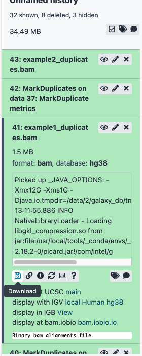

web : [sbc.shef.ac.uk](http://sbc.shef.ac.uk)  
twitter: [SheffBioinfCore](https://twitter.com/SheffBioinfCore)  
email: [bioinformatics-core@sheffield.ac.uk](bioinformatics-core@sheffield.ac.uk)

-----

# Tutorial Overview and Background

This tutorial will cover the basics of NGS analysis using Galaxy; a open-source web-based platform for the analysis of biological data. You should gain an appreciation of the tasks involved in a typical NGS analysis and be comfortable with the outputs generated by a sequencing service. You will also use the Integrative Genomics Viewer (IGV) to *view* some of the data we generate in an interactive manner.

Parts of this tutorial are based on the tutorials from the Galaxy Training Network

- [Galaxy Training Network](https://training.galaxyproject.org/training-material/)

We will be using Illumina short-read sequencing as our technology of interest, as it is by far the prevalent type of data available. 

## Using these notes

<div class="exercise">
Sections with this background indicate exercises to be completed during the workshop.
</div>

<div class="information">
Sections with this background highlight particular shortcuts or other references that might be useful.
</div>

<div class="warning">
Sections with this background give information about potential error messages you might encounter, or problems that might arise in your own data analysis.
</div>

-----

A short introduction to Next Generation Sequencing can be found in this youtube video

- [Next Generation Sequencing (Illumina) An Introduction - Henrik's Lab](https://www.youtube.com/watch?v=CZeN-IgjYCo)

## Experimental Design

Before embarking on any high-throughput experiment, it is important to pay due attention to the *experimental design*. This famous quote from the statistician R.A Fisher in the 1938 is still applicable to modern technologies

> **To call in the statistician after the experiment is done may be no more than asking him to perform a postmortem examination: he may be able to say what the experiment died of.**

Experimental Design encompasses questions such as

- which controls to use?
  - positive / negative controls
  - healthy controls
- what experimental conditions?
- what technical and biological factors are present?

When performing a high-throughput experiment, our measurements will be subject to biological variation (which will may be interested in) and technical variation (which we probably won't be). Being able to control these factors and minimise biases is key to experimental design.

Confounding factors in our design may arise by accident, or might be caused by not considering all possible sources of variation:-


(image from Cancer Research UK Cambridge Institute course on Experimental Design)

We can also introduce so-called "batch-effects" by our choices when samples are prepared for sequencing. Large experiments may necessitate multiple runs or batches, and we should try and minimize the possible impact of batches but including a good representation of each condition of interest in each batch.


(image from Cancer Research UK Cambridge Institute course on Experimental Design)

When planning next-generation sequencing experiments, you will also need to consider

- the type of sequencing (e.g. whole-genome, exome, RNA-seq)
  + will largely be dictated by your biological question
- single-end or paired-end
- how many reads (10 Million? 20 Million?, 100 Million?)

Some recommendations on these questions and more are provided by the [Cancer Research Uk Cambridge Institute Genomics Core](https://www.cruk.cam.ac.uk/core-facilities/genomics-core/sequencing). Often the sequencing vendor performing your experiment will have some default options available.

The vendor may not advise on the *sample-size*; how many samples you will be sequencing to address your biological hypothesis of interest. This is a complex question and is often influenced by practical and financial constraints. The Sheffield Bioinformatics Core is able to advise on this, and any of the other issues above. `bioinformatics-core@sheffield.ac.uk`


## Where do the data in this tutorial come from?

The data for this tutorial are publicly-available human cell-lines *downsampled* to a few genomic regions of interest. The steps of the workflow that we illustrate in this workshop will be applicable to various forms of sequencing analysis (e.g. exome-seq, whole-genome seq, RNA-seq). We will discuss the specific workflows in subsequent workshops, and where applicable, explain how they deviate from this generic workflow.


## Galaxy, and it's limitations?

- Disk space
- Queuing times
- Tool availability

# Section 1: Preparation 

**Ignore if you have already created a Galaxy account and uploaded the example data in a previous exercise**

#### 1.  Register as a new user at Europen public Galaxy server

- https://usegalaxy.eu

**Make sure you check your email to activate your account**

#### 2. Use this link on November 29th to access a reserved queue

- [https://usegalaxy.eu/join-training/sbcgalaxy-2021-11-29](https://usegalaxy.eu/join-training/sbcgalaxy-2021-11-29)

#### 3.  Import the data for the workshop.

We can going to import the [*fastq* files](https://en.wikipedia.org/wiki/FASTQ_format) for this experiment. This is a standard format for storing raw sequencing reads and their associated quality scores. However, as we will see, the representation of the quality scores has changed over time.

You can import the data by:

1.  In the tool panel located on the left, under Basic Tools select **Get
    Data > Upload File**. Click on the **Paste/Fetch data** button on the
    bottom section of the pop-up window.
2.  Upload the example data for this workshop by selecting the files `example1_R1.fastq` `example1_R2.fastq`,`example2_R1.fastq` and `example2_R2.fastq`. You don't need to specify the file type or genome build. Galaxy should be able to make a reasonable guess.


3.  You should now have these 2 files in your history:
    - `example1_R1.fastq`
    - `example1_R2.fastq`
    - `example2_R1.fastq`
    - `example2_R2.fastq`

<div class="information">
You might sometimes see a `.gz` at the end of a fastq file name. This means that it is *compressed* (like a zip file). The fastq files are sometimes called `.fq` or `.fq.gz`, but the contents should be the same.
</div>

### Uploading large files

<div class="warning">
Galaxy recommend that large datasets (Gbs of data) are uploaded using *FTP*. Instructions for doing this can be found here:-

https://galaxyproject.org/ftp-upload/

**N.B. If you are using the European server, replace `usegalaxy.org` with `usegalaxy.eu` when following the instructions**

You will need an FTP program such as [*filezilla*](https://filezilla-project.org/), which is free to download and available for Mac and Windows. 


</div>

## Quick tour of the Galaxy interface

The Galaxy homepage is divided into three panels

- List of available tools on the left
- Panel to view current tool options, or view output
- History; a record of the analyses you have performed


(image from [a short introduction to Galaxy](https://training.galaxyproject.org/training-material/topics/introduction/tutorials/galaxy-intro-short/tutorial.html))

### Tools

The tools panel gives access to the many, many different tools that you be run through Galaxy. The tools are divided into different sections to make navigation easier. If you know the name of the tool you want to use, you can also search for it in the text box. A list of tools matching that name will be shown.

### Viewing panel

When you have selected a tool that you would like to use, it's options will appear in the main Viewing panel. The tool can be executed by using the Execute button. Some documentation on the tools and the expected outputs should also be found here. Once you click on Execute, a new entry (or entries) will be created in the history.

### History

The History is Galaxy's log of all the analyses you have performed. You should aim to have a separate history for each analysis you perform, and the history can be named to allow you to keep track of all your analyses.


-----

<div class="exercise">

**Exercise**: Rename the history for this workshop to "NGS Intro" (or similar)

</div>

-----


The history will contain all the outputs that you have generated as part of your analysis. To inspect a particular output, you can click on the "eye" icon. We will do this shortly for the fastq files that we have just uploaded.

You may notice that as items are added to the history, the colour they are displayed in changes over time. There four possible colours

- Grey; the job is being held in a queue
- Orange; the job is currently being run
- Green; the job has completed successfully
- Red; the job failed. You will need to double-check the options and try again

There are several options add the top of the History panel to create a new History, View all current Histories and access other settings for the current History including deleting files that are no longer required. It is advisable to pay attention to the disk usage quota in the top right corner. At the moment, this will probably be showing `Using 0%`


# Section 2: Fastq file format

You can view the files you just uploaded by clicking the **eye icon** the history item. The first few lines should read as follows


**example1_R1.fastq**

```
@D0ENMACXX111207:1:1201:3771:127083
AGACAAAATTGTCTGCTGTTCTAGTCAACAGTGTCCTGGAGGTTTCAACCAGTGCAATTGGCAAACAAACAAACAAACAAACTAGCTAGAAAAGTACCTGG
+
CCCFFFFFHHHHHJIJJJJIJJIJIJJEHIIHGIGHIJJIIJ?FHIIGJJIIIIIGGIJJJJJJJJIIIIJJFHHHBEEFFDEEDDCDDDDDDD@CDCCD<
```

**example1_R2.fastq**

```
@D0ENMACXX111207:1:1201:3771:127083
AAAGACCTTGTCTCTAAAAAATAATAATAATAGTTAGGGATAATGCATTTAAATCTGTCTCACTGAAATAGTAAGAATGAAATCAAAGTGCTCAAGACAGC
+
C@CFFFFFHHHHHJJJJJJJIIIIJJJJJJJJJJIIIJJJJJIJJJIIIJIJJJJIJIJJJJJIIGJJJIJFGGHIJJIFFHGGHFFFFFFEEDEEEDDDD
```


The first line is the unique identifier for each sequenced read. It can be used to encode information such as the *sequencing machine*, *flow cell* and *lane* that the read was generated from, and the physical coordinates on the lane. *Notice that the ID for the first read in the `_R1` and `_R2` files is the same*. Sometimes these will have a `/1` or `/2` to indicate the "first" or "second" read.

The quality scores are [ASCII](http://ascii-code.com/) representations of how confident we are that a particular base has been called correctly. Letters that are further along the alphabet indicate higher confidence. This is important when trying to identify types of genome variation such as single base changes, but is also indicative of the overall quality of the sequencing. Different scales have been employed over time (resulting in a different set of characters appearing in the file). 


## Deriving the Quality Score

First of all, we convert the base-calling probability (p) into a `Q` score using the formula

- Quality scores $$ Q = -10log_{10}p$$
    + Q = 30, p=0.001
    + Q = 20, p=0.01
    + Q = 10, p=0.1
- These numeric quantities are *encoded* as [**ASCII**](http://ascii-code.com/) code
    + At least 33 to get to meaningful characters
    (https://en.wikipedia.org/wiki/FASTQ_format)
    
      

## Quality Scores to probabilities

- look-up the ASCII code for each character
- subtract the offset to get the Q score
- convert to a probability using the formula:-

$$ p = 10^{-Q/10} $$

Let's see this calculation for the first few bases of the first read in `example1_R1`; `C@CFFF....`

Character  | Code | Minus 33 Offset | Probability
------------- | ------------- | ------------- | -------------
C  | 67 | 34 | 0.00040 
@  | 64 | 31 | 0.00079
C  | 67 | 34 | 0.00040
F  | 70 | 37 | 0.00020
F  | 70 | 37 | 0.00020
F  | 70 | 37 | 0.00020

In practice, we don't have to convert the values as we have software that will do this automatically

-----

# Section 3: Quality assessment with FastQC

[FastQC](https://www.bioinformatics.babraham.ac.uk/projects/fastqc/) is a popular tool from [Babraham Institute Bioinformatics Group](https://www.bioinformatics.babraham.ac.uk/index.html) used for *quality assessment* of sequencing data. Most Bioinformatics pipelines will use FastQC, or similar tools in the first stage of the analysis. The [documentation](https://www.bioinformatics.babraham.ac.uk/projects/fastqc/Help/) for FastQC will help you to interpret the plots and stats produced by the tool. A traffic light system is used to alert the user's attention to possible issues. 

- From the left hand tool panel in Galaxy, under *GENOMIC FILE MANIPULATION*, select *FASTA/FASTQ -> FastQC* (Or using the Search tools box)
- Select one of the FASTQ files as input and *Execute* the tool.
- When the tool finishes running, you should have an HTML file in your History. Click on the eye icon to view the various quality metrics.

The most important image is whether the base quality decreases significantly over the length of the read


Good quality data should look something like:-


Look at the generated FastQC metrics for your uploaded fastq files. This data looks pretty good - high per-base quality scores (most above 30).

All is not lost if we observe poor quality bases towards the end of the read. There are a number of *trimming* options that we can use for NGS data and some of these are available through Galaxy. Check out the [Trimmming Reads](https://galaxyproject.org/tutorials/ngs/#trimming-reads) section of the Galaxy NGS tutorial if you are interested in how we can trim our reads.

It is also worth bearing in mind that the tool is blind to the particular type of sequencing you are performing (i.e. whole-genome, ChIP-seq, RNA-seq) and the organism being sequenced, so some warnings might be expected due to the nature of your experiment. For instance, there are known sequencing composition biases that can occur at the beginning of RNA-seq reads. 

## Aggregating QC reports with multiqc

For datasets with large numbers of fastq files, it may be useful to aggregate the individual reports into a single combined report. 

- Under the tools section, select *Quality Control -> MultiQC*
- Make sure *Which tool was used to generate logs* is set to `FastQC`
- In *Results file*, select the **RawData** results files that you have just generated

You should then be able to view the fastqc plots for both the fastq files on the same page.

<div class="warning">
The most common cause of errors are not selecting FastQC as the tool used to generate logs, and not selecting the RawData outputs.
</div>

# Section 4: Trimming

# Section 5: Alignment

We don't really spend much time look at *fastq* files, as most of our time is spent with *aligned* reads. i.e. we have used some software to tell us whereabouts in the genome each read belongs to. This will *usually* be performed for you as part of a sequencing service, but it is good to get an appreciation of the steps involved.

In this section we map the reads in our FASTQ files to a reference genome. This figure from the Galaxy Training Network illustrates the procedure for three reads that map at positions 100, 114 and 123 of a reference genome


A plethora of different tools have been written to perform this task, and we will not describe it in detail. Alignment relies on the reference genome being *indexed* so that the sequencing reads can be located more efficiently. The genome index is a highly-accessible data structure, and Galaxy includes indices for many popular genomes. 

#### 1.Align the example files  


- Find the tool *Mapping* -> *Map with BWA*
  + alternatively, type `bwa` in the search box
- In *Select input type?* Select **Paired-fastq**
- Use *example1_R1.fastq* and *example1_R2.fastq* as the first and second set of reads respectively.
- Make sure the reference genome is set to **Human Dec. 2013 (GRCh38/hg38) (hg38)**
- Press *Execute*
- Wait!

The result will be a `.bam` file that we will describe in the next section. This file is not human-readable, as it is compressed. But we can convert to a readable format for illustration purposes.

#### 2. View the alignments

1.  Click on the eye of the resulting file to view the alignments.


### About the `bam` file format

Unlike most of Bioinformatics, a *single standard* file format has emerged for aligned reads. Moreover, this file format is consistent regardless of whether you have DNA-seq, RNA-seq, ChIP-seq... data. 

The `bam` file is a compressed, binary, version of a `sam` file.

### The `.sam` / `.bam` file

The first part of the header lists the names (`SN`) of the sequences (chromosomes) used in alignment, their length (`LN`) and sometimes a *md5sum* "[digital fingerprint](https://en.wikipedia.org/wiki/Md5sum)" of the `.fasta` file used for alignment (`M5`).

```

@HD VN:1.3 SO:coordinate
@SQ SN:chr1 LN:248956422
@SQ SN:chr10 LN:133797422
@SQ SN:chr11 LN:135086622
@SQ SN:chr11_KI270721v1_random LN:100316
@SQ SN:chr12 LN:133275309
@SQ SN:chr13 LN:114364328
.....
.....

```


We also have a section where we can record the processing steps used to derive the file
```
@PG ID:bwa PN:bwa VN:0.7.17-r1188 CL:bwa sampe /data/db/data_managers/hg38/bwa_mem_index/hg38/hg38.fa first.sai second.sai /data/dnb03/galaxy_db/files/f/9/3/dataset_f9387692-2b3f-49c9-8228-d7309300ed28.dat /data/dnb03/galaxy_db/files/d/0/c/dataset_d0c79616-35a9-4b4d-a0e4-35a7ad74737b.dat"
....
....

```

Next is a *tab-delimited* section that describes the alignment of each sequence in detail. 

```
D0ENMACXX111207:2:2103:9825:158567	99	chr1	169176747	60	101M	=	169176962	316	AATTGGGCATTCTTCAGAAGGATGAGCTCAACTAAAAAAGAAGAGTCAGAAAAATCTCTTAACTCACTTTTATATAAATTACTTAGTATTTTAGCAAAAAC	CCCFFFFFHAHHHJJIJJJJJJJJJJJJJJJJJJJJJJJJJJJIIBFHIIIJJIIIJJJJJJJJJIJJHHHHHFFFFFFFDEEEEEADEEEEEDDDDDDDD	XT:A:U NM:i:0 SM:i:37 AM:i:37 X0:i:1 X1:i:0 XM:i:0 XO:i:0 XG:i:0 MD:Z:101`
```


Column | Official Name | Brief
------ | -------------- | -----------
1      | QNAME          | Sequence ID
2      | FLAG           | Sequence quality expressed as a bitwise flag
3      | RNAME          | Chromosome
4      | POS            | Start Position
5      | MAPQ           | Mapping Quality
6      | CIGAR          | Describes positions of matches, insertions, deletions w.r.t reference
7      | RNEXT          | Ref. name of mate / next read
8      | PNEXT          | Position of mate / next read
9      | TLEN           | Observed Template length
10     | SEQ            | Sequence
11     | QUAL           | Base Qualities

There can also be all manner of optional tags as extra columns introduce by an aligner or downstream analysis tool. A common use is the `RG` tag which refers back to the read groups in the header.


### Sorting and indexing

You will notice from the 3rd column that the reads are ordered according to their start position; whereas the reads in the `fastq` file were arranged in order that they were generated on the flow cell. By default, `bwa-mem` produces a bam where the reads are in the same order as the `fastq`. However, this is rather inconvenient for analysis where we require reads from the same location to be next to each other in the file.

An additional couple of steps have been performed after bwa-mem; sorting the file according to genome position and producing an *index* file. The index file does not provide any useful information for us and cannot be viewed in Galaxy. However, we will need it later on when viewing the data in IGV. 

<div class="information">
Should you ever need to, you can sort a `bam` file by coordinate or name using the **Samtools sort** tool in Galaxy. The **Samtools view** tool can also be used to convert between `.sam` and `.bam` file types
</div>

### Quality Flags

The *"flags"* in the sam file can represent useful QC information

  + Read is unmapped
  + Read is paired / unpaired
  + Read failed QC
  + Read is a PCR duplicate (see later)

The combination of any of these properties is used to derive a numeric value


For instance, a particular read has a flag of 163


### Derivation

There is a set of properties that a read can possess. If a particular property is observed, a corresponding power of 2 is added multiplied by 1. The final value is derived by summing all the powers of 2.


Flag Value | Meaning
---------- | --------------------------------
69 (= 1 + 4 + 64) 	| The read is paired, is the first read in the pair, and is unmapped.
77 (= 1 + 4 + 8 + 64) |	The read is paired, is the first read in the pair, both are unmapped.
83 (= 1 + 2 + 16 + 64) |	The read is paired, mapped in a proper pair, is the first read in the pair, and it is mapped to the reverse strand.
99 (= 1 + 2 + 32 + 64) |	The read is paired, mapped in a proper pair, is the first read in the pair, and its mate is mapped to the reverse strand.
133 (= 1 + 4 + 128) |	The read is paired, is the second read in the pair, and it is unmapped.
137 (= 1 + 8 + 128)  |	The read is paired, is the second read in the pair, and it is mapped while its mate is not.
141 (= 1 + 4 + 8 + 128) |	The read is paired, is the second read in the pair, but both are unmapped.
147 (= 1 + 2 + 16 + 128) |	The read is paired, mapped in a proper pair, is the second read in the pair, and mapped to the reverse strand.
163 (= 1 + 2 + 32 + 128) |	The read is paired, mapped in a proper pair, is the second read in the pair, and its mate is mapped to the reverse strand.


See also

- https://broadinstitute.github.io/picard/explain-flags.html

### Have a CIGAR!


The ***CIGAR*** (**C**ompact **I**diosyncratic **G**apped **Alignment** **R**eport) string is a way of encoding the match between a given sequence and the position it has been assigned in the genome. It is comprised by a series of letters and numbers to indicate how many consecutive bases have that mapping.


 
 Code  | Description
------------- | -------------
M  | alignment match
I  | insertion
D  | deletion
N  | skipped
S  | soft-clipping
H  | hard-clipping


e.g.

- `68M`
    + 68 bases matching the reference
- `1S67M`
    + 1 soft-clipped read followed by 67 matches
- `15M87N70M90N16M`
    + 15 matches following by 87 bases skipped followed by 70 matches etc.


#### 3. Check the alignment stats

We will now generate a few basic statistics about the alignment of our data

1. Select the tool *SAM/BAM:- > Samtools flagstat* 
2. In the *BAM File to report statistics of* box choose the bam file produced by bwa-mem.


The tool will also report how many ***PCR Duplicates*** have been found in the data. But as we haven't yet run any software to identify such reads, the flagstat output will show 0 reads.

1. Find the tool *SAM/BAM -> Samtools idxstats*
2. In the *BAM file* dropdown select the bam file produced by bwa-mem

The output of this tool will tell you how many reads aligned to each chromosome in your reference genome.


### About Duplicates

The preparation of a sequencing library requires *PCR* amplification of your starting material. This can lead to some DNA fragments being over-represented in your data. As our DNA fragments are formed in a random process, and relatively small compared to the number of bases to be sequenced from the genome (3Gb in humans), we tend to think the two DNA fragments that have identical starting and ending position are unlikely to have occurred due to chance. Some software, such as [Picard](http://broadinstitute.github.io/picard/) will identify such artefacts and *mark* them for attention by downstream methods. i.e. they are not completely discarded from the analysis.


#### 4. Mark Duplicates with Picard

1. Use the tool *Picard -> MarkDuplicates*
2. In *Select SAM/BAM dataset or dataset collection* choose the bam file produced by bowtie2.
3. What do you notice about the *flag* values for any reads that have the same *start* as another read? 
4. Interpret the meaning of these flags using the online tool
  + https://broadinstitute.github.io/picard/explain-flags.html

**Warning** the assumption about reads having the same start location being PCR duplicates falls down when we do sequencing for a very specific region of the genome. e.g. targeted sequencing from a panel of cancer genes. Running a tool to mark PCR duplicates on such data would recommend a high proportion of reads be ignored from further analysis.
  
#### 5. (Optional) Re-run the alignment statistics

1. Select the tool *SAM/BAM -> Samtools flagstat* 
2. In the *BAM File to report statistics of* box choose the bam file produced by the *mark duplicates* step


#### 4. Download your bam file

For the next step you will need to download the `bam` file that you produced. To do this, you can click the floppy disk icon.



**Make sure that you click both Download dataset and Download bam_index**

# Section 5. Visualising the aligned reads with IGV

Whilst Bioinformatics tools are very powerful and allow you to perform statistical analyses and test hypotheses, there is no substitute for **looking at and exploring the data**. A trained-eye can quite quickly get a sense of the data quality before any computational analyses have been run. Furthermore, as the person requesting the sequencing, you probably know a lot about the biological context of the samples and what to expect.

We will load the aligned reads that we have just created into IGV and start to get a feel for the process of variant calling

1. Download IGV

You can download IGV for Windows using this link 

- https://software.broadinstitute.org/software/igv/download

*Extract* the zip file that you have downloaded


Double-Click the file `igv` to launch IGV


<font size="5">
If you are unable to download IGV, you should be able to run a web-app from the Broad Institute website with the same functionality.

https://igv.org/app/

</font>


2. Load a reference Genome and some Data Tracks

By default, IGV should load with Human genome version *hg19* already loaded. It is essential that you use the **same genome version** that the reads were aligned to. You can check / change the genome by clicking the drop-down menu in the upper-left


We can also load extra *tracks* into the browser that can help us understand our variant calls. We can load data from *dbSNP* which will tell us about common mutations that already been identified. These can be loaded via *File* -> *Load from Server..* and selecting `dbSNP 1.4.7` from the `Variation and Repeats` section


3. Navigate around IGV

When IGV loads up we start with a very high-level view of the genome where *all* chromosomes are visible. Such a view might be useful if we were interested in large copy-number variation across a cohort of samples. However, we are mostly interested in changes at the individual base-level which is not possible to view at this resolution. We need to navigate to a particular region of interest.

Alongside the drop-down menu used to change the genome, there is a drop-down menu to select a particular chromosome and a box where we can enter text. Inside the text box we can enter a particular genome interval of interest

e.g. `chr1:10,000-11,000`


IGV should now be displaying a region on chromosome 1 from base position `10,000` to `11,000`. 


At this resolution, we can start to see the *genome sequence*. Each DNA base is represented by a different colour (A = green, C = blue) and it seems that this region is highly-repetitive; comprising mostly `C` bases. We can zoom further in using the zoom control in the top right of IGV


We can use the zoom control, and also move along the genome by holding down by mouse button and sliding left-and-right, to navigate to whatever genomic location we want. If we known the name of the gene we want to interrogate we can navigate directly there using the text box


The text box should now update to show the coordinates of `BRCA1` (`chr17:....`). At the bottom of the screen we can now see the *gene model* for the gene `BRCA1`.  Genes are represented as lines and boxes. Lines represent intronic regions and boxes represent exonic regions. The arrows indicate the direction / strand of transcription for the gene.


4. Load the aligned reads

Choose File > Load from File..., select the bam file that you downloaded from Galaxy, and click OK. Note that the bam and index files must be in the same directory for IGV to load these properly.


The main display of IGV should now update to hold tracks for the aligned reads from this bam file. It may seem like nothing is being displayed. This is because we are zoomed-out too far to be able to see the reads. **Use the zoom function and move along the genome until you get to the first exon of BRCA1**. After you have zoomed-in far enough you will start to see some grey rectangles. *These are the aligned reads*. Note that some *downsampling* may occur meaning that not all reads are displayed to reduce memory requirements.

If you hover over a particular read, how will see columns from the bam file being displayed such as the mapping quality and information about the paired reads.

Coloured-letters within the read indicate bases that are different to the reference genome. The entire read may be coloured differently to grey, which can indicate different things depending on how the display has been configured. For example, it can highlight paired-reads with an *insert size* different to that expected ([see here](https://software.broadinstitute.org/software/igv/interpreting_insert_size)). The display of aligned reads can be configured through the menus, as described [here](http://software.broadinstitute.org/software/igv/Preferences#Alignments). 
