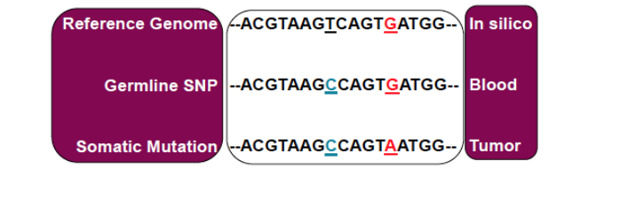
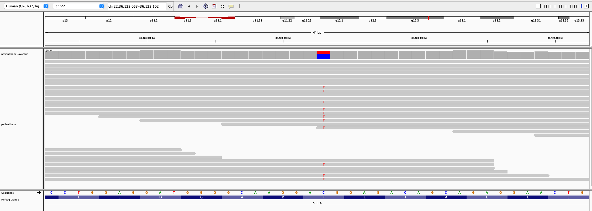
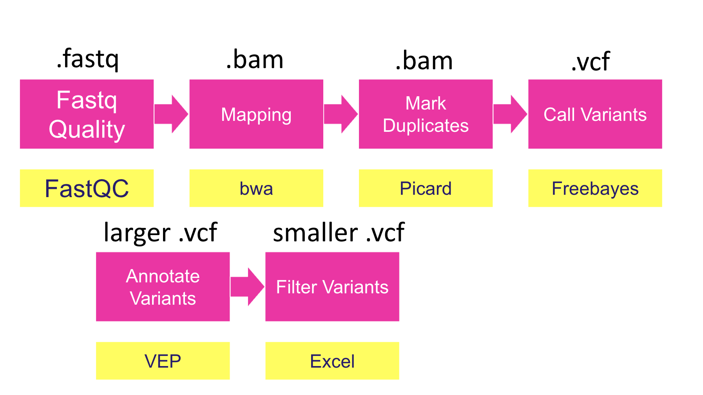
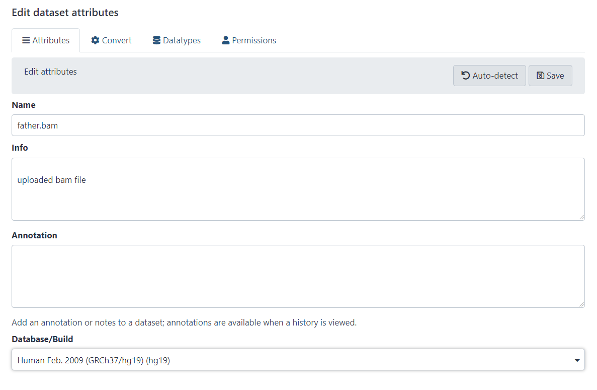
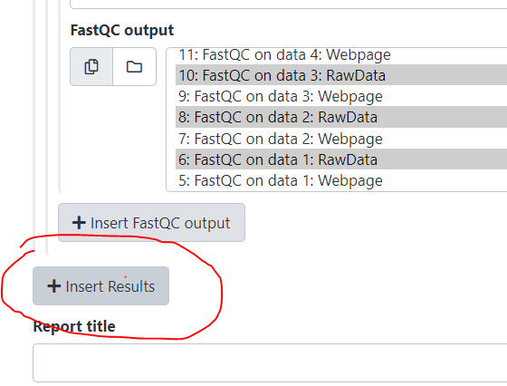
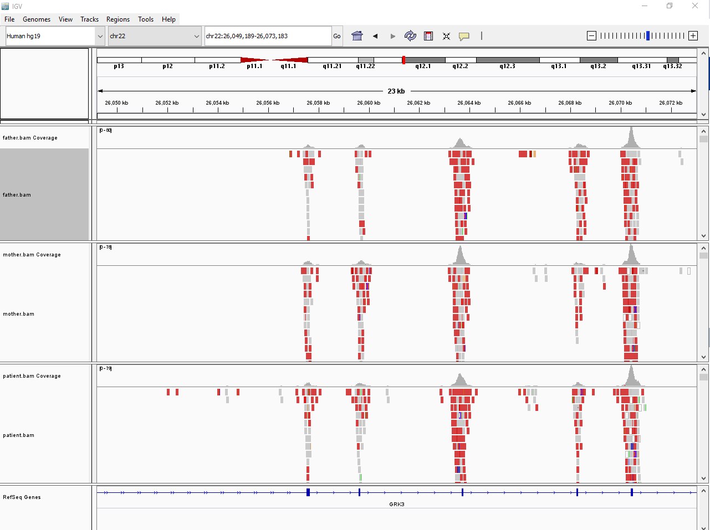
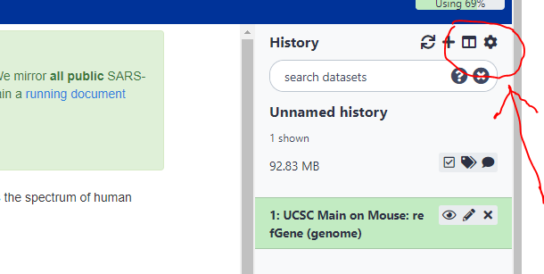
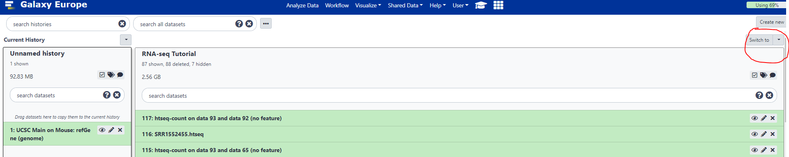
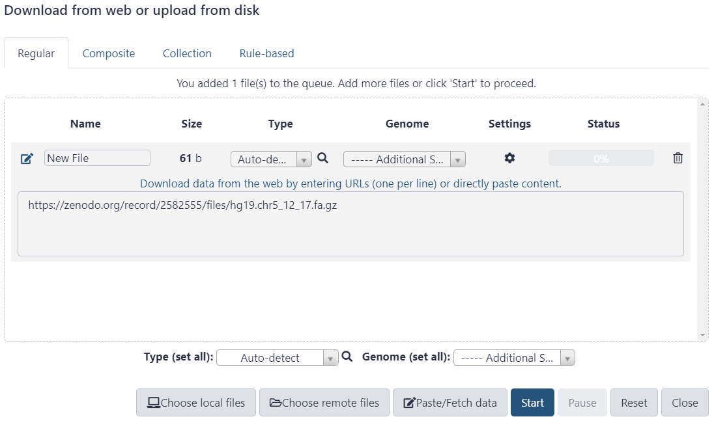
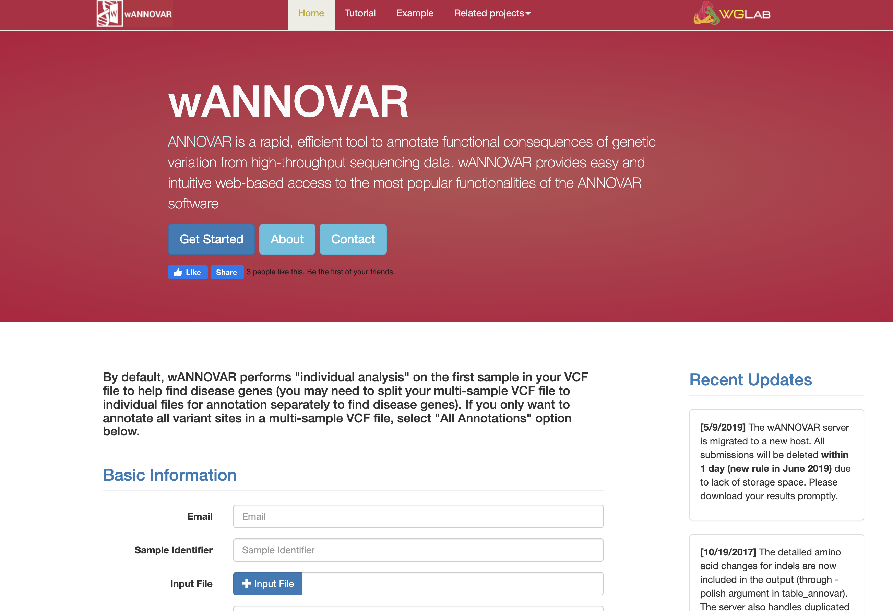

### Sheffield Bioinformatics Core


web : [sbc.shef.ac.uk](http://sbc.shef.ac.uk)  
twitter: [SheffBioinfCore](https://twitter.com/SheffBioinfCore)  
email: [bioinformatics-core@sheffield.ac.uk](bioinformatics-core@sheffield.ac.uk)

-----

# Tutorial Overview

This tutorial will cover the basics of variant-calling using Galaxy; a open-source web-based platform for the analysis of biological data. You should gain an appreciation of the tasks involved in a typical NGS analysis and be comfortable with the outputs generated by a sequencing service. You will also use the Integrative Genomics Viewer (IGV) to *view* the aligned reads in an interactive manner.

We will use training materials provided by the Galaxy Project and sign-post to relevant sections. If you want to find more detailed tutorials on IGV or Galaxy you can follow the links below:-

- [Galaxy Training Portal](https://training.galaxyproject.org/training-material/)
- [IGV Tutorial](https://github.com/griffithlab/rnaseq_tutorial/wiki/IGV-Tutorial)

Our primary analysis of interest is to identify *Single Nucleotide Polymorphisms* (SNPs) that are germline or somatic. The same methods can also be used to identify small insertions and deletions - *indels*.

<div class="information"/>

We will not be considering other types of genomic variation, such as large insertions and deletions and re-arrangements. Although these are also possible in Galaxy

e.g. 

- **Variant Calling** -> **Delly cnv** discover and genotype copy-number variants
- **Variant Calling** -> **Delly call** and genotype structural variants
</div>



We have already started to look at our data in IGV, and can identify possible mutations by eye:-



However, the situation is rarely straightforward. Whether we really believe that a variant is present at a particular position will depend on several factors

- Number of reads containing *reference* base (C in above example)
- Number of reads containing *alternative* base (T in above example)
- Overall depth of position (coverage)
- Quality of base calls
- Mapping quality

Specialised tools have been developed to identify genomic positions in our sequencing data where a variant is possible; and assign some kind of confidence in the results

Identifying potential variants is only the start of the analysis. In a disease context, we will want to known which variants are potentially harmful (the majority won't be).

The workflow is summarised below




# Preparation and Data Upload

If attending this workshop in-person you should have access to a private queue on the usegalaxy.eu server that will allow your jobs to run quicker.

Follow this link on December 1st to join the queue 

https://usegalaxy.eu/join-training/sbcgalaxy-2021-12-01

## Import the *Germline* data for the workshop.

We are using data from a *trio* of individuals that have been downsampled to be used in various Galaxy tutorials:-

- https://zenodo.org/record/60520#.YYkrqtbP3xo

Download all the files ending in `.bam` to your laptop. These files can also be found in the shared google drive.

You can import the data by:

1.  In the tool panel located on the left, select **Get
    Data > Upload File**. 
2.  **Choose local file** and browse to the directory containing the files from the google drive and select all the file. Click **Open** to close the file browser. The names of the files should now appear in Galaxy.
3.  Click **Start** to begin the upload

3.  You should now have these 3 files in your history:

- `mother.bam`
- `father.bam`
- `patient.bam`

<div class="exercise">

**Question**: What is the primary purpose of the `.bam` file? What Bioinformatics processes / tools have already been performed on the data?

</div>

## Set the genome build

As we didn't align these data in Galaxy, we don't automatically have a record of which reference genome was used. This may cause problems downstream. You can specify a genome build by using the pencil icon next to the names of the `bam` files in your history and choosing hg19 from the **Database/Build** drop-down.




## Quality control

As with other types of high-throughput data, we should perform a quality assessment to check that the data are suitable for further processing. Here is a summary of some of the tools we could use:-

### fastQC

<div class="information">

FASTA/FASTQ -> **FastQC** Read Quality reports

</div>


We have already used this tool in the Introduction to NGS session. It will provide a quality assessment of the base-calls of our sequencing. It does not use any information about the alignment, but can still be run on `.bam` files due to the raw sequences being present in the `.bam` file.


### idxstats

<div class="information">

SAM/BAM -> **Samtools idxstats** reports stats of the BAM index file

</div>


This QC tool will report how many reads aligned to each of the reference chromosomes in a reference genome. It is part of the `samtools` suite of tools.


### samtools flagstat

<div class="information">

SAM/BAM -> **Samtools flagstat** tabulate descriptive stats for BAM dataset

</div>


This tools extracts the "flag" data contained in the `.bam` file and tabulates the results. The flag is used to encode various properties of reads such as being a PCR duplicate, being un-mapped, or having a paired read within an expected insert distance.

### Combined QC report with multiqc

<div class="information">

Quality Control -> **MultiQC** aggregate results from bioinformatics analysis into a single report

</div>

The multiQC tool that we have seen previously can be used to combine outputs from a set of samples into a single report that is easier to digest. 

Moreover, the tools can also be used to combine the results of mutliple reporting tools via the `Insert Results` button




<div class="exercise">

**Exercise**: Inspect the `.bam` files, and use the output of the QC tools to answer the following questions:-

- Which tool was used to align the reads?
- What chromosome have the reads been aligned to?
- Are the data single- or paired-end?
- Has a tool been run to mark duplicates?
</div>


## Viewing the alignments

If we are reasonably happy with the QC, the next step would be to inspect the data visually. As we have seen in the previous session, IGV is a very convenient tool for this. 



<div class="exercise">

**Exercise:** Load the input bam files into IGV. The first time you try and do this, it should give an error about an "index" file missing. Which file is it missing? See the IGVtools option under the Tools menu of IGV and see if you can generate the missing files.

**Make sure to set hg19 as your reference genome**. Once the files are loaded, navigate to `chr22` and zoom until you start to see reads. The data are supposed be from an exome sequencing experiment. Does it looks like exons have been sequenced? What differences might you see in whole-genome data?

</div>

<div class="information">
Using a different genome version for alignment and variant calling may be problematic for downstream analysis. If we did not align the data ourselves are not 100% sure about the exact genome used, it might be wise to re-align the data.

We can start this process by extracting the *fastq* reads from the `.bam` file and following the workflow from the previous session

**Picard** -> **SamToFastq** extract reads and qualities from SAM/BAM dataset and convert to fastq
</div>

# Post-processing of reads and Variant Calling

We will now go through a series of steps to produce a set of variant-calls ready for further interpretation.

## Mark Duplicates with Picard

As we have seen, it does not appear the duplicates have been identified in the data. This is commonly-done using the `Picard` suite of tools. Recall that PCR Duplicates are reads that have exactly the *same sequence* and map to the *same genomic location*, so we assume that they are arise from the same DNA fragment. Our variant calling approaches rely on having reliable estimates of how many times a particular genomic location has been sequenced, so it is important to mark locations containing duplicates.


<div class="information">

Picard -> **MarkDuplicates** examine aligned records in BAM datasets to locate duplicate molecules

</div>

- Select the `father.bam`, `mother.bam` and `patient.bam` files in the **Select SAM/BAM dataset or dataset collection**. Don't forget you can select multiple bam files using the multiple datasets button.
- No other options need to be changed

It is recommended that you rename the BAM outputs so that you can keep track of your analysis; for example `patient_nodups.bam`, `father_nodups.bam` and `mother_nodups.bam`.


## Call variants in the Patient sample with `Freebayes`

We will call variants in our trio of samples using the `FreeBayes` tool. As it's name implies, this is a method based on computing *Bayesian* probabilities. A more-detailed explanation is provided in [this Galaxy tutorial](https://training.galaxyproject.org/training-material/topics/variant-analysis/tutorials/dip/tutorial.html).

In brief, the tool considers the bases that are called at a given position and assess what the *most-likely* genotype is. 

------


------

The required parameters for freebayes are given below. Notice that we restrict the analysis to just chromosome 22.

<div class="information">

Variant Calling -> **FreeBayes** bayesian genetic variant detector

</div>

- **Choose the source for the reference genome** Locally cached
- Select Merge output VCFs in **Run in batch mode**
- Under **Bam dataset** select the patient bam file with **duplicates marked**
- **Using reference genome** Human (Homo sapiens): hg19
- **Limit variant calling to a set of regions?** Limit to region
  - **Region Chromosome**: chr22
  - **Region Start**: 1
  - **Region End**: 51304566
- **Read coverage**: Use defaults
- **Choose parameter selection level** 1. Simple diploid calling

<div class="warning">
If you didn't set the genome build for the bam files, the tool may refuse to run. Use the pencil icon next to the bam files to edit and specify hg19 as the genome build (see above for screenshot).
</div>

Again, it would be good to rename these outputs to something more memorable; e.g. `patient.vcf`. We will now explore the file we have just created.

## About vcf format


In the previous section, you will have produced a *vcf* file. The `.vcf` format was initially developed by the [1000 Genomes Project](http://www.1000genomes.org/wiki/Analysis/vcf4.0), and ownership has been subsequently transferred to [Global Alliance for Genomics and Health Data Working group file format team](http://ga4gh.org/#/fileformats-team). The format can be used to represent information about all kinds of genomic variation. In this session we will just consider SNVs.

We don’t require any specialised software to look at the contents of a vcf file. They can be opened in a standard text editor, however your laptop may try and interpret the file as containing contact information (virtual contact file).

In a similar vein to the `.bam` and `.sam` files we saw earlier, the `.vcf` files contains many lines of header information. These describe the reference sequences and information on how the variant calls and genotypes are represented. **N.B. Even though we only called variants on a particular genomic region, the reference sequences used in the original alignment will still be present here**

It may ease the interpretation of these new files by running the following tool to convert them into a tab-delimited file

<div class="information">
Variant Calling -> **VCFtoTab-delimited** Convert VCF data to TAB delimited format
</div>

```
##fileformat=VCFv4.2
##fileDate=20211109
##source=freeBayes v1.3.1-dirty
##reference=/data/db/reference_genomes/hg19/seq/hg19.fa
##contig=<ID=chr10,length=135534747>
......
......
##commandline="freebayes --region chr22:1..51304566 --bam b_0.bam --fasta-reference /data/db/reference_genomes/hg19/seq/hg19.fa --vcf ./vcf_output/part_chr22:1..51304566.vcf"
##INFO=<ID=NS,Number=1,Type=Integer,Description="Number of samples with data">
##INFO=<ID=DP,Number=1,Type=Integer,Description="Total read depth at the locus">
##INFO=<ID=DPB,Number=1,Type=Float,Description="Total read depth per bp at the locus; bases in reads overlapping / bases in haplotype">
##INFO=<ID=AC,Number=A,Type=Integer,Description="Total number of alternate alleles in called genotypes">
......
......
##FORMAT=<ID=GT,Number=1,Type=String,Description="Genotype">
##FORMAT=<ID=GQ,Number=1,Type=Float,Description="Genotype Quality, the Phred-scaled marginal (or unconditional) probability of the called genotype">
##FORMAT=<ID=GL,Number=G,Type=Float,Description="Genotype Likelihood, log10-scaled likelihoods of the data given the called genotype for each possible genotype generated from the reference and alternate alleles given the sample ploidy">
##FORMAT=<ID=DP,Number=1,Type=Integer,Description="Read Depth">

```

After many more lines of information, we finally get to the details of the actual calls themselves. This part of the file is tab-delimited; with 10 columns for every call. The vcf specification page gives details of what should be contained in each column


Shown here is the information about three calls

```
#CHROM	POS	ID	REF	ALT	QUAL	FILTER	INFO	FORMAT	RS024V-FATHER
chr22	16123469	.	T	G	1.11972	.	AB=0;ABP=0;AC=2;AF=1;AN=2;AO=3;CIGAR=1X;DP=3;DPB=3;DPRA=0;EPP=3.73412;EPPR=0;GTI=0;LEN=1;MEANALT=1;MQM=2.66667;MQMR=0;NS=1;NUMALT=1;ODDS=1.22395;PAIRED=1;PAIREDR=0;PAO=0;PQA=0;PQR=0;PRO=0;QA=107;QR=0;RO=0;RPL=2;RPP=3.73412;RPPR=0;RPR=1;RUN=1;SAF=2;SAP=3.73412;SAR=1;SRF=0;SRP=0;SRR=0;TYPE=snp;technology.ILLUMINA=1	GT:DP:AD:RO:QR:AO:QA:GL	1/1:3:0,3:0:0:3:107:-0.746352,-0.90309,0
chr22	16124819	.	T	C	42.5105	.	AB=0;ABP=0;AC=0;AF=0;AN=2;AO=4;CIGAR=1X;DP=21;DPB=21;DPRA=0;EPP=5.18177;EPPR=9.26925;GTI=0;LEN=1;MEANALT=1;MQM=1;MQMR=1;NS=1;NUMALT=1;ODDS=9.78835;PAIRED=0;PAIREDR=0.411765;PAO=0;PQA=0;PQR=0;PRO=0;QA=148;QR=586;RO=17;RPL=1;RPP=5.18177;RPPR=9.26925;RPR=3;RUN=1;SAF=4;SAP=11.6962;SAR=0;SRF=17;SRP=39.9253;SRR=0;TYPE=snp;technology.ILLUMINA=1	GT:DP:AD:RO:QR:AO:QA:GL	0/0:21:17,4:17:586:4:148:0,-5.95171,-1.11016
chr22	16125108	.	A	T	10.7921	.	AB=0;ABP=0;AC=0;AF=0;AN=2;AO=2;CIGAR=1X;DP=7;DPB=7;DPRA=0;EPP=7.35324;EPPR=6.91895;GTI=0;LEN=1;MEANALT=1;MQM=1;MQMR=1;NS=1;NUMALT=1;ODDS=2.39796;PAIRED=0;PAIREDR=0.4;PAO=0;PQA=0;PQR=0;PRO=0;QA=74;QR=181;RO=5;RPL=2;RPP=7.35324;RPPR=6.91895;RPR=0;RUN=1;SAF=0;SAP=7.35324;SAR=2;SRF=0;SRP=13.8677;SRR=5;TYPE=snp;technology.ILLUMINA=1	GT:DP:AD:RO:QR:AO:QA:GL	0/0:7:5,2:5:181:2:74:0,-1.91725,-0.269908
```

The first seven columns should look consistent across different genotype callers and are the easiest to interpret. These columns tell you where `FreeBayes` has identified a possible variant, and which base(s) are present in the reference genome and the sample.

The contents of the `INFO` and `FORMAT` columns will depend on what variant caller has been used. The `INFO` column contains metrics and other information related to each variant call as a set of `KEY=VALUE` pairs. Each pair is separated by a `;` character.

The INFO for the a variant call may read as:-

```
AB=0;ABP=0;AC=2;AF=1;AN=2;AO=3;CIGAR=1X;DP=3
```

or 

```
      Key   Value
AB=0  AB  0
ABP=0 ABP 0
AC=2  AC  2
```
etc...

The meaning of each key can be discovered by looking at the header for the file. e.g. `##FORMAT=<ID=DP,Number=1,Type=Integer,Description="Read depth">`. So this variant has a total of 3 bases covering it. **Don't worry if you don't understand all of the entries here**


The column in the file describes the genotype calls for sample. In the sample column (`RS024V-FATHER`) for the first variant we see the entry

```
1/1:3:0,3:0:0:3:107:-0.746352,-0.90309,0
```

These are values separated by a `:` character and they are interpreted in the same order as dictated by the FORMAT column; which is `GT:DP:AD:RO:QR:AO:QA:GL`


```
##FORMAT=<ID=GT,Number=1,Type=String,Description="Genotype">
##FORMAT=<ID=GQ,Number=1,Type=Float,Description="Genotype Quality, the Phred-scaled marginal (or unconditional) probability of the called genotype">
##FORMAT=<ID=GL,Number=G,Type=Float,Description="Genotype Likelihood, log10-scaled likelihoods of the data given the called genotype for each possible genotype generated from the reference and alternate alleles given the sample ploidy">
##FORMAT=<ID=DP,Number=1,Type=Integer,Description="Read Depth">
##FORMAT=<ID=AD,Number=R,Type=Integer,Description="Number of observation for each allele">
##FORMAT=<ID=RO,Number=1,Type=Integer,Description="Reference allele observation count">
##FORMAT=<ID=QR,Number=1,Type=Integer,Description="Sum of quality of the reference observations">
##FORMAT=<ID=AO,Number=A,Type=Integer,Description="Alternate allele observation count">
##FORMAT=<ID=QA,Number=A,Type=Integer,Description="Sum of quality of the alternate observations">
```

So for this particular variant there is a genotype of `1\1` (Homozygous for the alternate allele) in the sample and a depth of `3` etc. 

## View the Calls in IGV

A more interactive way to understand the `.vcf` is to view it in IGV. The `.vcf` can be loaded in the same session as the corresponding `.bam` file.

- [http://software.broadinstitute.org/software/igv/viewing_vcf_files](http://software.broadinstitute.org/software/igv/viewing_vcf_files)

<div class="exercise">

**Exercise**: View the following positions in IGV:- What genotype is called in the patient (Het or Homozygous for the alternate allele). Does a variant seem likely here?

- `chr22:17178684`
- `chr22:25275498`
- `chr22:36123083`
- `chr22:36123313`

Feel free to browse the other variant calls if you have time

</div>


## Refined variant-calling

For the current analysis we have one vcf output for each sample. An alternative analysis exists which will give a merged vcf as an output

- **Choose the source for the reference genome** Locally cached
- Select Merge output VCFs in **Run in batch mode**
- Under **Bam dataset** select the three bam files with **duplicates marked**
- **Using reference genome** Human (Homo sapiens): hg19
- **Limit variant calling to a set of regions?** Limit to region
  - **Region Chromosome**: chr22
  - **Region Start**: 1
  - **Region End**: 51304566
- **Read coverage**: Use defaults
- **Choose parameter selection level** 1. Simple diploid calling

The tool will produce as single vcf as before, but this time it will include data on the genotypes of all three samples. The file will be larger as it comprises variants identified in any of the samples. We can use this to identify variants that might be unique to the Patient.

<div class="exercise">
**Exercise**: Rename the merged output to `trio_raw.vcf` and verify that it does indeed contain variants for the trio of samples.
</div>

## Quality Filtering

`FreeBayes` has produced a large set of potential variants, and there are far too many to follow-up. It reports all variants; even those with little evidence of being genuine. With the `VCFfilter` tool we can remove unreliable calls from our dataset. We can filter using the many entries that are found in the `INFO` field.

<div class="information">
Variant Calling -> **VCFfilter** filter VCF data in a variety of attributes
</div>


- **VCF dataset to filter** - your combined VCF file from the trio
- **more filters**
  + **Select the filter type** Info filter (-f)
  + **Specify filtering value** `DP > 20`
- **Insert more filters**
  + **Select the filter type** Info filter (-f)
  + **Specify filtering value** `QUAL > 50`
  
The output from the filtering should reduce the number of variants drastically. There is an option to filter to variants within a specific region. This would be useful if we wanted to quickly extract variants in a particular gene. If we want to obtain variants within a set of regions we need a different approach.

## Intersect with exon regions

<div class="information">

Get Data -> **UCSC Main** table browser

</div>

If our list of potential variants is too long, we might also want to restrict it according to genomic regions. As we have performed a exome-seq experiment, we probably won't be interested in variants in intergenic or intronic regions. A file containing regions that are being used in the sequencing will usually be provided by the sequencing vendor. However, we can practice how to obtain these co-ordinates using the UCSC genome browser.

- Set *clade* to **Mammal**
- Set *genome* to **Human**
- *assembly* **Feb. 2009 (GRCm37/hg19)**
- *group* **Genes and Gene Prediction**
- *track* **UCSC Genes**
- *table* **knownGene**
- *position* **chr22**
- *output format* **BED - browser extensible data** and click *get output*
- On the next screen (**Output knownGene as BED**) click the checkbox `Exons plus` 100 bases at each end before *send output to* **Galaxy**

Click *get output* and *send query to Galaxy* to be returned to Galaxy. A new job will be submitted to retrieve the coordinates from UCSC

<div class="warning">

When you are returned to Galaxy from UCSC it might look like you have lost all the files in your analysis and are no longer logged in. 

To solve this, log back in and choose the **View all histories** option under the History panel.



There should be two "histories"; one containing all the outputs you generated before accessing UCSC, and one containing the UCSC output. All this point you can switch back to your previous history, and drag the box containing the UCSC ouput to this history



</div>

We can now *intersect* our variant calls with the gene coordinates

<div class="information">

Variant Calling -> **VCF-BEDintersect** Intersect VCF and BED datasets

</div>


- **Select VCF dataset** your VCFFilter output
- **BED dataset or an interval to intersect with** the BED output from UCSC

This tool will help restrict our search to coding regions, but it won't tell us *which gene* a variant lies within, or what the impact of the variant is. For this, we will need to follow a process called annotation.


<div class="information">

An interesting option in this tool is **Invert Selection?** which will return all the variants **NOT** intersecting with the regions in your bed file. 

</div>

<div class="information">

The `FreeBayes` tool can also use a `BED` file as a set of regions to call variants in. We could have restricted our analysis to these regions from the start.

</div>


## Sample-Specific Variants

We might also want to know which variants are specific to certain samples, or subsets of samples in our dataset. This is relevant to our dataset, as we might be looking for variants specific to the `patient`. The `SNPSift Filter` tool can be used to do this (and more besides).

<div class="information">
Variant Calling -> **SnpSift Filter** Filter variants using arbitrary expressions
</div>

Like the previous filtering tool, this requires us to write an expression to specify how we filter the data. However, the expressions we write can be more complicated. Check out some of the examples.

In particular, we can use functions `isRef()`, `isVariant()` to test if the calls for a particular sample match the reference or alternative. The expression `GEN[0]`, `GEN[1]` and `GEN[2]` are used to represent the genotypes for the 1st, 2nd and 3rd samples respectively. 

- **Variant input file in VCF format** your filtered file from the previous step
- **Filter criteria** `isRef(GEN[0]) & isVariant(GEN[1]) & isRef(GEN[2])`

<div class="warning">
The filtering criteria given above assumes that genotypes appear in the order `Father`, `Patient`, `Mother` in the `vcf` file. If they do not appear in this order, you will need to change the criteria.
</div>

<div class="warning">
There might not be any sample-specific variants in this particular downsampled dataset, so if you want to see the tool in action you want have to select the "raw" `trio.vcf` file instead
</div>

## (Optional) Case-Control studies

<div class="information">
Variant Calling -> **SnpSift CaseControl** Count samples are in case and control groups
</div>

Similar to the previous use-case, for some studies we are looking for variants common to a set of patients (cases) compared to controls. For this task, the `CaseControl` function of `SnpSift` can be used which will annotate each variant for how many cases and controls it is observed in, along with a p-value for association. These new entries in the `vcf` can then be used for filtering.

# Annotation

## Annotation with Ensembl VEP

A useful annotation tool is the online VEP tool provided by Ensembl. This will annotate our variants with gene identifiers and also provide some predictions about the impact of the variant. 

More documentation on Ensembl VEP is [available online](http://grch37.ensembl.org/info/docs/tools/vep/online/index.html)

Command line tools are available, but we will use the online interface; making sure that we access the version of VEP with the correct genome version. Going straight to the Ensembl VEP website will mean using a later genome build.

The **hg19** version of VEP can be accessed [here](http://grch37.ensembl.org/Homo_sapiens/Tools/VEP). A set of coordinates can be entered into the text box, or a VCF file can be uploaded.


You will have a choice about what transcript database to use. The output can also be configured by clicking the *+* symbol next to a particular section. e.g. *Variants and frequency data*. After selecting the options you want, scroll down to the bottom of the page and click **Run**. The screen should now change to let you know that VEP is running.


The screen will refresh by itself, and eventually a green *Done* box should appear. At which point you will be able to inspect the results


The results can be inspected online, or downloaded. Downloading as a text file is better for browsing in Excel, and can also be manipulated in languages such as R.

The Consequence column can be used to prioritise variants of interest. It will indicate if the variant detected is likely to have an impact on transcription. This page describes all the possible entries that could appear:-

- [https://www.ensembl.org/info/genome/variation/prediction/predicted_data.html](https://www.ensembl.org/info/genome/variation/prediction/predicted_data.html)

<div class="exercise">
**Exercise:** Use Ensembl VEP to annotate your filtered VCF file, and take some time to digest the results.
</div>

<div class="information">
The link to VEP for the latest genome version is:-

- [https://www.ensembl.org/Tools/VEP](https://www.ensembl.org/Tools/VEP)

Note that in the Species box you can search and select which organism you are interested in. VEP is also available for plants, bacteria and funghi

- [http://plants.ensembl.org/Tools/VEP](http://plants.ensembl.org/Tools/VEP)
- [https://bacteria.ensembl.org/Tools/VEP](https://bacteria.ensembl.org/Tools/VEP)
- [https://fungi.ensembl.org/Tools/VEP](https://fungi.ensembl.org/Tools/VEP)

</div>


# Variant Calling for Matched Normal Samples

In this example we will consider the case when we want to find variants that exist in a patient's tumour sample, but not their normal tissue. Such analyses are related to the germline example, but have other considerations:-

- contamination of normal tissue in the tumour
- tumour heterogeneity


## Uploading the data

The data for this section can be found in the Session2 folder of the google drive:-

- https://drive.google.com/drive/folders/1SqXZjkkR2JXXsKUPkdls0SoFTb6FVqTp?usp=sharing

Download both the `tumour.bam` and `normal.bam` files and upload to Galaxy using the Upload File interface. You can also download the index (`bai`) files to be used in IGV. These do not need to be uploaded to Galaxy though.

You will also need a modified version of the reference genome that includes just chromosomes 5, 12 and 17. To load this file into Galaxy you can choose the *Paste/Fetch data* option instead of *Choose local files*. Paste the following URL into the text box

- `https://zenodo.org/record/2582555/files/hg19.chr5_12_17.fa.gz`




## Use Varscan to call somatic variants

<div class="information">
Variant Calling -> **VarScan somatic** Call germline/somatic and LOH variants from tumor-normal sample pairs
</div>

- Select `Use a genome from my history` as choose the uploaded `hg19.chr5_12_17.fa.gz` 
- Choose `normal.bam` and `tumour.bam` as the **aligned reads from normal sample** and **aligned reads from tumor sample** respectively

Like `freebayes`, this method will give us an output in `vcf` format. The genotypes for the tumour and normal are reported and we can use the `INFO` entries to determine which calls are specific to the tumour. The tool also provides some quality assessment of the calls that can be used to filter possible false positives. The filtering can be performed using `VCFfilter` as before.

<div class="information">
Variant Calling -> **VCFfilter** filter VCF data in a variety of attributes
</div>


The number of potential variants is quite large, but we can filter using `VCFfilter`

- **VCF dataset to filter** Your `.vcf` output from `varscan`
- **Specify filtering value** `FILTER = PASS`

<div class="exercise">
**Exercise**: Based on the header of the varscan output, what filter would you need to restrict the data to just somatic mutations? Add this filter to VCFfilter.
</div>

For the annotation of the calls we will again use a tool outside Galaxy, so **download your filtered file**.

## Annotation of the somatic calls

The ensembl VEP tool that we have used previously can be used to annotate the calls. Another relevant tool is wAnnovar, which can add annotations from clinically-relevant databases such as [clinvar](https://www.ncbi.nlm.nih.gov/clinvar/intro/) and [COSMIC](https://cancer.sanger.ac.uk/cosmic).



- Access the wAnnovar webpage; [https://wannovar.wglab.org/](https://wannovar.wglab.org/)
- Select the filtered varscan output as the Input file
- Enter a valid email address and Sample Name

You will receive an email annotation when the annotation process has finished. The results can then be viewed in a web browser, or downloaded.

The number of columns may seem a bit daunting, and you probably won't need to use all of them. Here is a brief summary

- **ExonicFunc** if the variant occurs within a coding region, what impact does it have on the protein?
- **1000G...** frequency of the variant within various 1000 Genomes samples
- **COSMIC ID** ID of the variant in the COSMIC database (if applicable)
- **CLINVAR SIG** clinical significance if variant appears in CLINVAR

<div class="information">
Some information on the databases that wAnnovar uses can be found in the documentation for the *command-line* version of the tool

- [https://annovar.openbioinformatics.org/en/latest/user-guide/filter/#summary-of-databases](https://annovar.openbioinformatics.org/en/latest/user-guide/filter/#summary-of-databases)

</div>

<div class="exercise">
**Exercise** There are many possible tools for detecting somatic variants. Another that is present in Galaxy is `STRELKA`

- Locate the `STRELKA` tool and run somatic-calling on the tumour / normal pair
- Filter the output from this tool to just the calls that PASS it's filtering

</div>

Ideally, we would *intersect* the results from both callers to get a higher confidence set. This could be done using the VCFIntersect tool we have seen previously. However, due to the restricted nature of the dataset, this won't yield any results.

# Recap

We started our analysis from data that had been aligned to a reference genome. The popular freebayes tools was used to identify genomic positions with evidence of a difference from the reference. With further filtering and annotation we can obtain a list of medically-relevant variants for follow-up.


