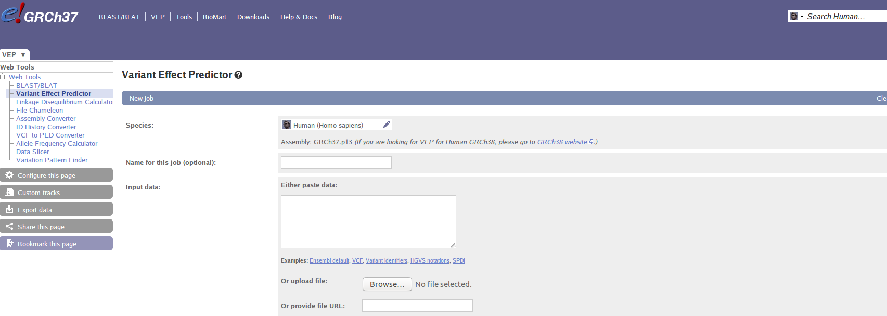
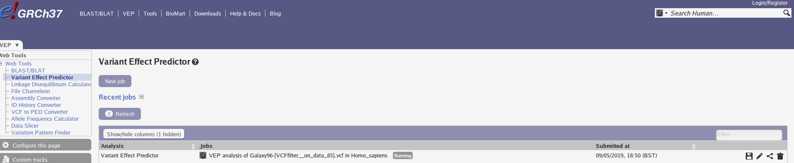
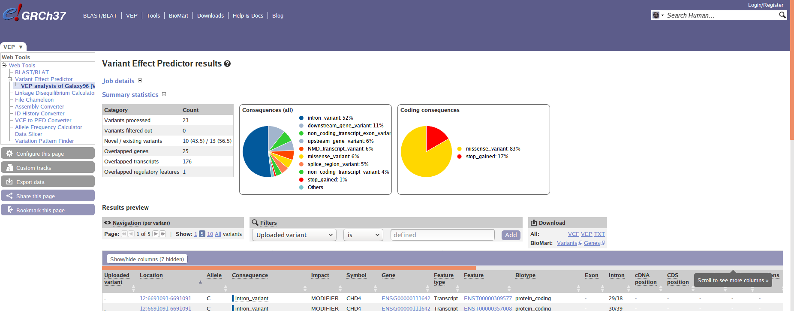

### Sheffield Bioinformatics Core


web : [sbc.shef.ac.uk](http://sbc.shef.ac.uk)  
twitter: [SheffBioinfCore](https://twitter.com/SheffBioinfCore)  
email: [bioinformatics-core@sheffield.ac.uk](bioinformatics-core@sheffield.ac.uk)

-----

# Tutorial Overview

This tutorial will cover the basics of varaint-calling using Galaxy; a open-source web-based platform for the analysis of biological data. You should gain an appreciation of the tasks involved in a typical NGS analysis and be comfortable with the outputs generated by a sequencing service. You will also use the Integrative Genomics Viewer (IGV) to *view* the aligned reads in an interactive manner.

We will use training materials provided by the Galaxy Project and sign-post to relevant sections. If you want to find more detailed tutorials on IGV or Galaxy you can follow the links below:-

- [Galaxy Training Portal](https://training.galaxyproject.org/training-material/)
- [IGV Tutorial](https://github.com/griffithlab/rnaseq_tutorial/wiki/IGV-Tutorial)

The first part of the tutorial covers the following steps in our analysis pipeline


We are using data from a trio of individuals that were sequenced as part of the Genome in a Bottle project. The data were downsampled to be used in various Galaxy tutorials:-

- https://zenodo.org/record/60520#.YYkrqtbP3xo


# Preparation and Data Upload

If attending this workshop in-person you should have access to a private queue on the usegalaxy.eu server that will allow your jobs to run quicker.

Follow this link on December 1st to join the queue 

https://usegalaxy.eu/join-training/sbcgalaxy-2021-12-01

## Import the data for the workshop.

Download all the files ending in `.bam` in this directory to your laptop

You can import the data by:

1.  In the tool panel located on the left, select **Get
    Data > Upload File**. 
2.  **Choose local file** and browse to the directory containing the files from the google drive and select all the file. Click **Open** to close the file browser. The names of the files should now appear in Galaxy.
3.  Click **Start** to begin the upload

3.  You should now have these 3 files in your history:

- `mother.bam`
- `father.bam`
- `patient.bam`

## Quality control

### fastQC
### idxstats
### samtools flagstat

<div class="exercise">

**Exercise**: Use the output of the QC tools to answer the following questions

- Which tool was used to align the reads?
- What chromosome have the reads been aligned to?
- Are the data single- or paired-end?
- Has a tool been run to mark duplicates?

</div>

When can now use the multiqc to combine these into a single report.

## Viewing the alignments

<div class="exercise">

**Exercise:** Load the input bam files into IGV. The first time you try and do this, it should give an error about an "index" file missing. Which file is it missing? See the IGVtools option under the Tools menu of IGV and see if you can generate the missing files.

Once the files are loaded, navigate to `chr22` and zoom until you start to see reads. The data are supposed be from an exome sequencing experiment. Does it looks like exons have been sequenced? What differences might you see in whole-genome data.

</div>

# Post-processing of reads and Variant Calling

## Mark Duplicates with Picard

## Call variants with Freebayes

Specify region as Chromosome 22, Start 1, End 50818468

## About vcf format


In the previous section, you will have produced a *vcf* file. The `.vcf` format was initially developed by the [1000 Genomes Project](http://www.1000genomes.org/wiki/Analysis/vcf4.0), and ownership has been subsequently transferred to [Global Alliance for Genomics and Health Data Working group file format team](http://ga4gh.org/#/fileformats-team). The format can be used to represent information about all kinds of genomic variation. In this session we will just consider SNVs.

We don’t require any specialised software to look at the contents of a vcf file. They can be opened in a bog-standard text editor, however your laptop may try and interpret the file as containing contact information (virtual contact file).

In a similar vein to the `.bam` and `.sam` files we saw earlier, the `.vcf` files contains many lines of header information. These describe the reference sequences and various filters that have been applied.


```
##fileformat=VCFv4.2
##FILTER=<ID=PASS,Description="All filters passed">
##reference=ref.fa
##contig=<ID=chr5,length=180915260>
##contig=<ID=chr12,length=133851895>
##contig=<ID=chr17,length=81195210>
##FILTER=<ID=VarCount,Description="Fewer than 4 variant-supporting reads">
##FILTER=<ID=VarFreq,Description="Variant allele frequency below 0.05">
##FILTER=<ID=VarAvgRL,Description="Average clipped length of variant-supporting reads < 90">
......
......

```

After many more lines of information, we finally get to the details of the actual calls themsevles. This part of the file is tab-delimited; with 10 columns for every call. The vcf specification page gives details of what should be contained in each column


Shown here is the information about three calls

```
#CHROM	POS	ID	REF	ALT	QUAL	FILTER	INFO	FORMAT	NORMAL	TUMOR
chr5	225768	.	G	C	.	VarReadPos	DP=27;SS=1;SSC=0;GPV=5.1363e-16;SPV=1	GT:GQ:DP:AD:ADF:ADR	1/1:.:16:0,16:0,2:0,14	1/1:.:11:0,11:0,1:0,10
chr5	230980	.	A	G	.	PASS	DP=157;SS=1;SSC=0;GPV=0;SPV=1	GT:GQ:DP:AD:ADF:ADR	1/1:.:88:0,88:0,51:0,37	1/1:.:69:0,69:0,45:0,24
chr5	231111	.	T	C	.	PASS	DP=127;SS=1;SSC=0;GPV=0;SPV=1	GT:GQ:DP:AD:ADF:ADR	1/1:.:75:0,75:0,39:0,36	1/1:.:52:0,52:0,26:0,26
```

The first seven columns should look consistent across different genotype callers. The contents of the `INFO` and `FORMAT` columns will depend on what variant caller has been used. The `INFO` column contains metrics and other information related to each variant call as a set of `KEY=VALUE` pairs. Each pair is separated by a `;` character.

The INFO for the a variant call may read as:-

```
DP=27;SS=1;SSC=0;GPV=5.1363e-16;SPV=1
```

or 

```
      Key   Value
DP=27 DP    27
SS=1  SS    1
SSC=0 SSC   0
GPV=5.1.. GPV   5.1363e-16
SPV=1 SPV   1

```

The meaning of each key can be discovered by looking at the header for the file. e.g. `##FORMAT=<ID=DP,Number=1,Type=Integer,Description="Read depth">`. So this variant has a total of 27 bases covering it. 


The final two columns in the file describes the calls for the NORMAL and TUMOUR samples respectively. In the sample column (`NORMAL`) for the first variant we see the entry

```
1/1:.:16:0,16:0,2:0,14
```

These are values separated by a `:` character and they are interpreted in the same order as dictated by the FORMAT column; which is `GT:GQ:DP:AD:ADF:ADR`

```
##FORMAT=<ID=GT,Number=1,Type=String,Description=Genotype>
##FORMAT=<ID=GQ,Number=1,Type=Integer,Description="Genotype quality">
##FORMAT=<ID=DP,Number=1,Type=Integer,Description="Read depth">
##FORMAT=<ID=AD,Number=R,Type=Integer,Description="Read depth for each allele">
##FORMAT=<ID=ADF,Number=R,Type=Integer,Description="Read depth for each allele on the forward strand">
##FORMAT=<ID=ADR,Number=R,Type=Integer,Description="Read depth for each allele on the reverse strand">
```

So for this particular variant there is a genotype of `1\1` (Homozygous for the alternate allele) in the normal sample and a depth of `16` etc. The same genotype information is repeated for the tumour. From this we can infer whether the variant is likely to be somatic or not and gain insight into whether it is a true variant or a false positive (which we will discuss in detail later).

## vcfToTab

## Get exons regions for Chromosome 22

## Call variants with Freebayes - Part 2

## Alternative: Overlap calls with Bed regions

## vcfFilter


# Annotation

## Annotating with SNPeff

As we have seen the standard vcf file contains genome coordinates for each variant, but gives no useful information about what gene (if any) the variant lies within or the potential impact of the variant. One such tool for adding genomic information is SNPeff which is described in the Galaxy tutorial.

- [See here](https://training.galaxyproject.org/training-material/topics/variant-analysis/tutorials/somatic-variants/tutorial.html#adding-annotations-to-the-called-variants); **"Adding functional genomic annotations" only**

SNPeff will produce a modified `vcf` file and a HTML report. 

<div class="alert alert-warning">

**Discussion:** Scroll through the contents of the vcf file produced by snpeff. What extra information has it added? Try and locate the variants within `BRCA1`. Also take some time to digest the contents of the HTML report and the information it provides

</div>


## Annotation with Ensembl VEP

A useful alternative to running SNPeff within Galaxy is the online VEP tool provided by Ensembl. This will annotate our variants with gene identifiers and also provide some predictions about the impact of the variant. 

More documentation on Ensembl VEP is [available online](http://grch37.ensembl.org/info/docs/tools/vep/online/index.html)

Command line tools are available, but we will use the online interface; making sure that we access the version of VEP with the correct genome version. Going straight to the Ensembl VEP website will mean using a later genome build.

The **hg19** version of VEP can be accessed [here](http://grch37.ensembl.org/Homo_sapiens/Tools/VEP). A set of coordinates can be entered into the text box, or a VCF file can be uploaded.



<div class="alert alert-warning">
Upload the `vcf` file that you annotated with SNPeff. If you were unable to complete this step, a copy is available in the google drive; `231335_231336_VarScan_Variants_SnpEff_SS2.vcf`.
</div>

You will have a choice about what transcript database to use. The output can also be configured by clicking the *+* symbol next to a particular section. e.g. *Variants and frequency data*. After selecting the options you want, scroll down to the bottom of the page and click **Run**. The screen should now change to let you know that VEP is running.



The screen will refresh by itself, and eventually a green *Done* box should appear. At which point you will be able to inspect the results



The results can be inspected online, or downloaded. Downloading as a text file is better for browsing in Excel, and can also be manipulated in languages such as R.

# Variant Calling for Matched Normal Samples

[Click here](somatic_snv_assessment_exercise.html) to follow an exercise on inspecting and evaluating somatic calls
