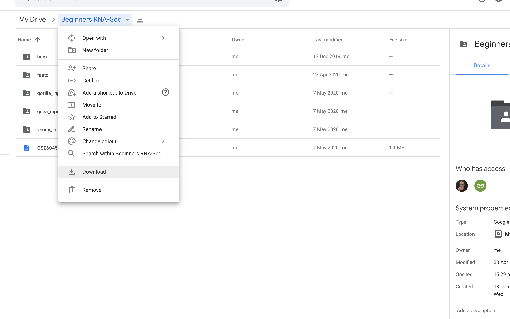

# Hands-on RNA-seq Analysis from fastq

### Sheffield Bioinformatics Core

web : [sbc.shef.ac.uk](https://sbc.shef.ac.uk)  
twitter: [@SheffBioinfCore](https://twitter.com/SheffBioinfCore)  
email: [bioinformatics-core@sheffield.ac.uk](bioinformatics-core@sheffield.ac.uk)

-----

## Tutorial Overview

This tutorial will cover the basics of RNA-seq using Galaxy and Degust; two open-source web-based platforms for the analysis of biological data. You should gain an appreciation of the tasks involved in a typical RNA-seq analysis and be comfortable with the outputs generated by the Bioinformatician.

## Using these notes

Sections with this background indicate exercises to be completed during the workshop.

Sections with this background highlight particular shortcuts or other references that might be useful.

Sections with this background give information about potential error messages or might encounter, or problems that might arise in your own data analysis.

### More on Galaxy

The official Galaxy page has many [tutorials](https://galaxyproject.org/learn/) on using the service, and examples of other types of analysis that can be performed on the platform.

Those eventually wanted to perform their own RNA-seq analysis (for example in R), should look out for other courses

### Courses on analysing RNA-seq data in R

- [Sheffield Bioinformatics Core](https://sbc.shef.ac.uk/training/rna-seq-in-r-2020-02-13/)
- [Monash Bioinformatics Platform](http://monashbioinformaticsplatform.github.io/RNAseq-DE-analysis-with-R/)

## RNA-seq workflow

Workflow image from Ting-you Wang's [RNA-seq data analysis page](https://databeauty.com/blog/tutorial/2016/09/13/RNA-seq-analysis.html)

-----

## Background

#### Where do the data in this tutorial come from?
The data for this tutorial comes from a Journal of Experimental Medicine paper ["Itraconazole targets cell cycle heterogeneity in colorectal cancer"](https://pubmed.ncbi.nlm.nih.gov/29853607/). This study examines the expression profiles of two cell lines in response to treatment with itraconazole.

For this tutorial, we will assume that the *wet-lab* stages of the experiment have been performed and we are now in the right-hand branch of the workflow. In this tutorial we will demonstrate the steps of **Quality assessment**, **alignment**, **quantification** and **differential expression testing**.

The *summarised* data for this experiment were made available on the Sequencing Read Archive with accession SRP144496. **For the purposes of this workshop we have created a downsampled dataset**

If you want to know how to obtain these data, see the optional Appendix

## Section 1: Preparation
#### 1. Sign-up to the European Galaxy server

- https://usegalaxy.eu
- The Australian server is an alternative if the European one is down:- https://usegalaxy.org.au/

**Make sure you check your email to activate your account**

#### 2. Download the course data

The data for this course have all been shared on a google drive. If you have not done so already, please download this directory as a zip file

https://drive.google.com/open?id=1ftuBP5L-rcXwsEub2mIaSDJ1tceHYFc7

#### 3.  Import the RNA-seq data for the workshop.

We can going to import the [*fastq* files](https://en.wikipedia.org/wiki/FASTQ_format) for this experiment. This is a standard format for storing raw sequencing reads and their associated quality scores. To make the practical quicker, we have *downsampled* the original fastq files to half a million reads.

#### **Get Data -> Upload File ** 

You can import the data by:

1.  In the tool panel located on the left, under Basic Tools select **Get Data > Upload File**. Click on the **Choose local file** button on the
    bottom section of the pop-up window.
2.  Navigate to the `fastq` directory of the zip file that you downloaded from google drive and select these two files are from the basal-virgin condition. 

`SRR1552444.fastq.gz`
`SRR1552450.fastq.gz`
 
 and these two files are from the basal pregnant condition.

`SRR1552452.fastq.gz`
`SRR1552453.fastq.gz`

3.  You should now have these 4 files in your history:
    - `SRR1552444.fastq.gz`
    - `SRR1552450.fastq.gz`
    - `SRR1552452.fastq.gz`
    - `SRR1552453.fastq.gz`

The `.gz` at the end of each file name means that it is *compressed* (like a zip file). 

## Quality assessment with FastQC (Optional)

[FastQC](https://www.bioinformatics.babraham.ac.uk/projects/fastqc/) is a popular tool from [Babraham Institute Bioinformatics Group](https://www.bioinformatics.babraham.ac.uk/index.html) used for *quality assessment* of sequencing data. Most Bioinformatics pipelines will use FastQC, or similar tools in the first stage of the analysis. The [documentation](https://www.bioinformatics.babraham.ac.uk/projects/fastqc/Help/) for FastQC will help you to interpret the plots and stats produced by the tool. A traffic light system is used to alert the user's attention to possible issues. However, it is worth bearing in mind that the tool is blind to the particular type of sequencing you are performing (i.e. whole-genome, ChIP-seq, RNA-seq), so some warnings might be expected due to the nature of your experiment.

#### *FastQ Quality Control* -> *FastQC Read Quality reports*

**Make sure you select this tool. There is another version of FastQC present, which does not produce some of the output we need for a later step**

- Select one of the FASTQ files as input and *Execute* the tool.
- When the tool finishes running, you should have an HTML file in your History. Click on the eye icon to view the various quality metrics.
- Run Fastqc on the remaing fastq files, but don't examine the results just yet.

**Question: Do the data seem to be of reasonable quality? **

You can use the [documentation](https://www.bioinformatics.babraham.ac.uk/projects/fastqc/Help/3%20Analysis%20Modules/) to help interpret the plots

If poor quality reads towards the ends of reads are considered to be a problem, or there is considerable adapter contamination, we can employ various tools to *trim* our data.

However, a recent paper demonstrated that read trimming is no longer required prior to alignment:- https://www.biorxiv.org/content/10.1101/833962v1

If you suspect contamination from adapter sequence or unacceptable quality scores towards the ends of reads various trimming options are supported by the *Trimmomatic* tool (amongst others)

#### *FASTA/FASTQ* -> *Trimmomatic*

The operations supported by trimmomatic will probably not be very informative on our example data (as it has already been processed), but you can try several operations if you get time:-

- Removing Illumina adapter sequences by setting *Perform initial ILLUMINACLIP* to *Yes* and selecting the appropriate adapter type
- Remove poor quality bases at the end of reads by choosing *Cut bases off the end of a read, if below a threshold quality (TRAILING)* under *Select Trimmomatic operation to perform*
- Remove poor quality bases at the start of reads by choosing *Cut bases off the start of a read, if below a threshold quality (LEADING)* under *Select Trimmomatic operation to perform*
- You can apply multiple operations in turn by clicking *Insert Trimmomatic Operation*

If you also suspect contamination by another organism, or rRNA present in your data, you can use the sortMeRNA tool to remove this artefact.

## Combining QC reports

It can be quite tiresome to click through multiple QC reports and compare the results for different samples. It is useful to have all the QC plots on the same page so that we can more easily spot trends in the data.

The [multiqc](https://multiqc.info/) tool has been designed for the tasks of aggregating qc reports and combining into a single report that is easy to digest.

*FASTQ Quality Control* -> *Multiqc*

Under *Which tool was used generate logs?* Choose *fastqc* and select the RawData output from the fastqc run on each of your bam files.

Question: Repeat the FastQC analysis for the remaining fastq files and combine the reports with `multiQC`. Do the fastq files seem to have consistently high-quality?

## Section 3: Quantification

We can align our RNA-seq reads to a reference *genome*, and then overlap with know gene coordinates, but many prefer to align directly to the *transcriptome* sequences using a method such as salmon or kallisto. We will demonstrate the salmon protocol.

### Obtaining the files for salmon

1) cDNA fasta file

This can be obtained from [Ensembl](http://m.ensembl.org/info/data/ftp/index.html)

2) Transcript mapping file

By default, salmon will produce counts for each *transcript*. This might be what we want, but for most standard analyses it is preferable to work at the gene-level. We therefore have to tell salmon how the transcripts in the cDNA file relate to known genes. Such a file can be obtained from [biomart](https://ensembl.org/biomart/martview/). 

- Select the Ensembl genes (104) database
- Select the dataset Human genes (GRCh38.13)
- In Attributes, click the "+" button next to GENE and select *Transcript stable ID version* and *Gene stable ID*. Make sure the order on the left-hand panel is *Transcript stable ID version*, followed by *Gene stable ID*. This will affect the column order in the file. You can tick / untick the IDs to make sure the order is correct.

- Click the Results button in the top left corner to see a preview of the results. Clicking the Go button will export the results to a file

**It is important that the file downloaded from Biomart is edited so that the column headings do not contain any spaces**. You can do this in a text editor. The edited file should look like this.

It is important to make sure the version number of your transcript file and the biomaRt dataset are **the same**, otherwise some of the steps downstream might not work as expected.

3) Annotation file (optional)

The Ensembl gene IDs are not particularly memorable, so it would be highly beneficial to have other annotations at hand to help us interpret the data downstream. We can use the biomart website again to produce a table to downstream intrepretation. 

This time, select only the *Gene Stable ID* tickbox in the GENE box. Expand the EXTERNAL panel by clicking the "+" next to EXTERNAL, and select *HGNC symbol* and *NCBI gene (formerly Entrezgene) ID*

### salmon configuration and running

- Select the *Homo_sapiens_GRCh38.cdna.all.fa.gz* file as the Transcripts fasta file
- Select all your uploaded fastq files as your Data Input FASTQ/FASTA file
- Scroll down *File containing a mapping of transcripts to genes* and select the *mart_export.txt* file

Two jobs will now be queued for each sample fastq file. The Quantification output will contain transcript-level data, and the Gene Quantification output will be at the gene-level. We should expect the number of lines in the Gene Quantification file to be substantially les. If not, you will need to check that your transcript mapping file was correct.

The Gene Quantification output from each sample comprises the following columns:-

- Name; The Ensembl Gene ID (Gene Stable ID from biomart)
- Length;
- Effective Length;
- TPM; Transcripts Per Million
- NumReads; The raw number of reads

Note that we are using a downsampled dataset, so the majority of NumReads will be zero.

### Create a count matrix

Methods for detecting differential expression are likely to want data in the form of a table; where every row is a different gene and each column is a unique biological sample. Before we can proceed we will therefore need to *merge* our salmon results into a single output. This can be down using the *Salmon quantmerge* tool

**RNA Analysis** -> **Salmon quantmerge**

Use the +Insert Quant file and names button repeatedly to select each of your *Gene Quantification* outputs. The One-word sample names text box can be used to create a shorter column name for each output.

Once all the Gene Quantification files have been selected the drop-down menu under **Columns** should be changed from Length to NumReads.

After the tool has finished you should have a table with 

### Adding extra annotation to results

**Text Manipulation** -> **Join two files**

- 1st file: *Column Join on data....*
- Column to use from 1st file: Column 1
- 2nd file: result from *annotateMyIDs on data...*
- Column to use from 2nd file: Column 1

### Differential Expression using Degust

Differential expression is possible using Galaxy using the DESeq2 tool (for example). However, our particular recommendation is to use Degust for a more interactive experience. For this section, we will be using counts generated on the full dataset, rather than the downsampled data analysed in the previous section. These counts are available in the file `GSE114013_salmon_counts.csv`.

