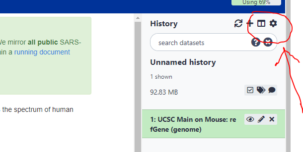

# Hands-on RNA-seq Analysis from fastq


### Sheffield Bioinformatics Core


web : [sbc.shef.ac.uk](https://sbc.shef.ac.uk)  
twitter: [@SheffBioinfCore](https://twitter.com/SheffBioinfCore)  
email: [bioinformatics-core@sheffield.ac.uk](bioinformatics-core@sheffield.ac.uk)

-----

## Tutorial Overview

This tutorial will cover the basics of RNA-seq using Galaxy and Degust; two open-source web-based platforms for the analysis of biological data. You should gain an appreciation of the tasks involved in a typical RNA-seq analysis and be comfortable with the outputs generated by the Bioinformatician.


## Using these notes

<div class="exercise">
Sections with this background indicate exercises to be completed during the workshop.
</div>

<div class="information">
Sections with this background highlight particular shortcuts or other references that might be useful.
</div>

<div class="warning">
Sections with this background give information about potential error messages or might encounter, or problems that might arise in your own data analysis.
</div>

### More on Galaxy

The official Galaxy page has many [tutorials](https://galaxyproject.org/learn/) on using the service, and examples of other types of analysis that can be performed on the platform.

Those eventually wanted to perform their own RNA-seq analysis (for example in R), should look out for other courses

### Courses on analysing RNA-seq data in R

- [Sheffield Bioinformatics Core](https://sbc.shef.ac.uk/training/rna-seq-in-r-2020-02-13/)
- [Monash Bioinformatics Platform](http://monashbioinformaticsplatform.github.io/RNAseq-DE-analysis-with-R/)

### Techniques not covered in the workshop

From our experience, the most common application of RNA-seq is still to perform a "differential expression" in order to identify genes, and eventually pathways, that are altered between a set of biological conditions. Therefore we will concentrate on this task in the workshop. We will also be considering *bulk* RNA-seq only. i.e. where our biological sample may be comprised of a pool of heterogeneous cells. Single-cell approaches are becoming more popular, and although there are some similiarities in how these data are processed, a different downstream analysis approach is required.

The Galaxy Training Network provides materials on single-cell analysis, and other applications not covered in this workshop.

- [Galaxy Training Network - Transcriptomics](https://training.galaxyproject.org/training-material/topics/transcriptomics/)


## RNA-seq workflow

Two workflows are possible with RNA-seq data - with the difference being whether one performs an alignment to the reference genome or not.

Recent tools for RNA-seq analysis (e.g. `salmon`, `kallisto`) do not require the time-consuming step of whole-genome alignment to be performed, and can therefore produce gene-level counts in a much faster time frame. They not require the creation of large bam files, which is useful if constrained by file space on Galaxy.


(image from Harvard Bioinformatics Core)


-----

## Background

#### Where do the data in this tutorial come from?
The data for this tutorial comes from a Journal of Experimental Medicine paper ["Itraconazole targets cell cycle heterogeneity in colorectal cancer"](https://pubmed.ncbi.nlm.nih.gov/29853607/). This study examines the expression profiles of two cell lines in response to treatment with itraconazole.


For this tutorial, we will assume that the *wet-lab* stages of the experiment have been performed and in this tutorial we will demonstrate the steps of **Quality assessment**, **alignment**, **quantification** and **differential expression testing**.

The fastq data for this experiment were made available on the Sequencing Read Archive (SRA) with accession SRP144496. **For the purposes of this workshop we have created a downsampled dataset**

The experimental design for the dataset is summarised in the table below.

run	| name	| cell_line	| condition
----|-------|-----------|--------- 
SRR7108388	| HT55_CONT_1	| HT55	| DMSO
SRR7108389	| HT55_CONT_2	| HT55	| DMSO
SRR7108390	| HT55_CONT_3	| HT55	| DMSO
SRR7108391	| HT55_CONT_4	| HT55	| DMSO
SRR7108392	| HT55_ITRA_1	| HT55	| ITRACONAZOLE
SRR7108393	| HT55_ITRA_2	| HT55	| ITRACONAZOLE
SRR7108394	| HT55_ITRA_3	| HT55	| ITRACONAZOLE
SRR7108395	| HT55_ITRA_4	| HT55	| ITRACONAZOLE
SRR7108396	| SW948_CONT_1 | SW948	| DMSO
SRR7108397	| SW948_CONT_2 | SW948	| DMSO
SRR7108398	| SW948_CONT_3 | SW948	| DMSO
SRR7108399	| SW948_CONT_4 | SW948	| DMSO
SRR7108400	| SW948_ITRA_1 | SW948	| ITRACONAZOLE
SRR7108401	| SW948_ITRA_2 | SW948	| ITRACONAZOLE
SRR7108402	| SW948_ITRA_3 | SW948	| ITRACONAZOLE
SRR7108403	| SW948_ITRA_4 | SW948	| ITRACONAZOLE

#### Digression: How to download raw sequencing files

The Sequencing Read Archive (SRA) is commonly-used to store the raw data from sequencing experiements and can be accessed through the NCBI website. However, the interface is not particularly friendly and the links to download data and not easy to obtain.

An easier alternative exists in the form of SRA Explorer

- [https://sra-explorer.info/](https://sra-explorer.info/)


The SRA accession (usually found in a paper describing the dataset) can be entered into the Search box, and all the samples belonging to that dataset should be found. Samples of interest can be saved, and upon "checkout" the download links (URLs) will be displayed. A command-line tool such as `curl` or `wget` can then be used to download the files locally.


## Section 1: Preparation
#### 1. Sign-up to the European Galaxy server


- https://usegalaxy.eu
- The Australian server is an alternative if the European one is down:- https://usegalaxy.org.au/


**Make sure you check your email to activate your account**


#### 2. Download the course data

The data for this course have all been shared on a google drive. If you have not done so already, please go to this directory and download the following files

https://drive.google.com/drive/folders/1RSuvl9shAw12Bj77uYSUdWtkZ5ST5EWi?usp=sharing

- `SRR7108388.fastq.gz`
- `SRR7108389.fastq.gz`
- `SRR7108392.fastq.gz`
- `SRR7108393.fastq.gz`
- `Homo_sapiens.GRCh38.cdna.all.fa.gz`
- `tx2gene.txt`


#### 3.  Import the RNA-seq data for the workshop.

We can going to import the [*fastq* files](https://en.wikipedia.org/wiki/FASTQ_format) for this experiment. This is a standard format for storing raw sequencing reads and their associated quality scores. To make the practical quicker, we have *downsampled* the original fastq files to a quarter of a million reads.

<div class="information">

#### **Get Data -> Upload File ** 

</div>

You can import the data by:

1.  In the tool panel located on the left, under Basic Tools select **Get Data > Upload File**. Click on the **Choose local file** button on the
    bottom section of the pop-up window.
2.  Navigate to the `fastq` directory of the zip file that you downloaded from google drive and select these two files from the HT55-DMSO condition. 

`SRR7108388.fastq.gz`
`SRR7108389.fastq.gz`
 
 and these two files are from the HT55 ITRACONAZOLE condition.

`SRR7108392.fastq.gz`
`SRR7108393.fastq.gz`

also upload the files `Homo_sapiens.GRCh38.cdna.all.fa.gz` and `tx2gene.txt`. These are reference files that we will use later.

3.  You should now have these 4 fastq files in your history:
    - `SRR7108388.fastq.gz`
    - `SRR7108389.fastq.gz`
    - `SRR7108392.fastq.gz`
    - `SRR7108393.fastq.gz`

The annotation files may take a while longer to upload

<div class="information">
The `.gz` at the end of each file name means that it is *compressed* (like a zip file). 
</div>

<div class="information">
You can upload the other files for extra practice if you wish
</div>

## Alternative upload

To save time, the raw data for this dataset have been uploaded to Galaxy. To access the history, use the link below

- [https://usegalaxy.eu/u/markdunning/h/beginners-rna-seq—salmon](https://usegalaxy.eu/u/markdunning/h/beginners-rna-seq—salmon)

There should be a button to import the history in the top-right corner. The raw data for the practical should now be available to you.

### Quality assessment with FastQC (Optional)

[FastQC](https://www.bioinformatics.babraham.ac.uk/projects/fastqc/) is a popular tool from [Babraham Institute Bioinformatics Group](https://www.bioinformatics.babraham.ac.uk/index.html) used for *quality assessment* of sequencing data. Most Bioinformatics pipelines will use FastQC, or similar tools in the first stage of the analysis. The [documentation](https://www.bioinformatics.babraham.ac.uk/projects/fastqc/Help/) for FastQC will help you to interpret the plots and stats produced by the tool. A traffic light system is used to alert the user's attention to possible issues. However, it is worth bearing in mind that the tool is blind to the particular type of sequencing you are performing (i.e. whole-genome, ChIP-seq, RNA-seq), so some warnings might be expected due to the nature of your experiment.

<div class="information">

#### *FastQ Quality Control* -> *FastQC Read Quality reports*

</div>

- Select one of the FASTQ files as input and *Execute* the tool.
- When the tool finishes running, you should have an HTML file in your History. Click on the eye icon to view the various quality metrics.
- Run Fastqc on the remaing fastq files, but don't examine the results just yet.


<div class="exercise">

**Question: Do the data seem to be of reasonable quality? **

You can use the [documentation](https://www.bioinformatics.babraham.ac.uk/projects/fastqc/Help/3%20Analysis%20Modules/) to help interpret the plots

</div>

If poor quality reads towards the ends of reads are considered to be a problem, or there is considerable adapter contamination, we can employ various tools to *trim* our data.

However, a recent paper demonstrated that read trimming is no longer required prior to alignment:- https://www.biorxiv.org/content/10.1101/833962v1


<div class="warning">

If you also suspect contamination by another organism, or rRNA present in your data, you can use the sortMeRNA tool to remove this artefact.
</div>


### Combining QC reports

It can be quite tiresome to click through multiple QC reports and compare the results for different samples. It is useful to have all the QC plots on the same page so that we can more easily spot trends in the data.

The [multiqc](https://multiqc.info/) tool has been designed for the tasks of aggregating qc reports and combining into a single report that is easy to digest.


<div class="information">

*FASTQ Quality Control* -> *Multiqc*

</div>

Under *Which tool was used generate logs?* Choose *fastqc* and select the RawData output from the fastqc run on each of your bam files.


<div class="exercise">

Question: Repeat the FastQC analysis for the remaining fastq files and combine the reports with `multiQC`. Do the fastq files seem to have consistently high-quality?
</div>


## Section 2: Quantification

Traditiaonlly, workflows for RNA-seq would align reads to a reference *genome*, and then overlap with know gene coordinates. However, many now prefer to align directly to the *transcriptome* sequences using a method such as [`salmon`](https://salmon.readthedocs.io/en/latest/) or [`kallisto`](https://pachterlab.github.io/kallisto/about). We will demonstrate the salmon protocol.

### Obtaining the files for salmon

1) cDNA fasta file

As we are going to align to a set of *transcripts* rather than the whole genome, we require a file that contains the sequence of each transcript. This file has been provided in the google drive folder and should have been uploaded to your Galaxy history.

- [https://drive.google.com/drive/folders/1RSuvl9shAw12Bj77uYSUdWtkZ5ST5EWi?usp=sharing](https://drive.google.com/drive/folders/1RSuvl9shAw12Bj77uYSUdWtkZ5ST5EWi?usp=sharing)

However, it is useful to know where this file came from in case you are not working with Human data. The file was obtained from [Ensembl](http://m.ensembl.org/info/data/ftp/index.html) by clicking on the **cDNA (FASTA)** link for the appropriate organism (Human). 


On the next screen,  Right-click to save the `.cdna.all.fa.gz` to your computer


The FASTA file is a large text file that lists all the transcripts for the given organism and their genomic sequence. You *could* open this in a standard text editor if you wished to see the contents. The contents are similar to that of a FASTQ file. In fact, the FASTQ file is a FASTA file with extra quality scores added.

The identifier line for each sequence (starting with `>`) names the transcript and the gene it is associated with. Since we obtained the file from Ensembl, the Transcripts and Genes begin with the `ENST` and `ENSG` respectively. The numbers after each transcript or gene are the *version numbers*; the sequence and defintion of each transcript / gene can evolve over time.

```
>ENST00000631435.1 cdna chromosome:GRCh38:CHR_HSCHR7_2_CTG6:142847306:142847317:1 gene:ENSG00000282253.1 gene_biotype:TR_D_gene transcript_biotype:TR_D_gene gene_symbol:TRBD1 description:T cell receptor beta diversity 1 [Source:HGNC Symbol;Acc:HGNC:12158]
GGGACAGGGGGC
>ENST00000415118.1 cdna chromosome:GRCh38:14:22438547:22438554:1 gene:ENSG00000223997.1 gene_biotype:TR_D_gene transcript_biotype:TR_D_gene gene_symbol:TRDD1 description:T cell receptor delta diversity 1 [Source:HGNC Symbol;Acc:HGNC:12254]
GAAATAGT
>ENST00000448914.1 cdna chromosome:GRCh38:14:22449113:22449125:1 gene:ENSG00000228985.1 gene_biotype:TR_D_gene transcript_biotype:TR_D_gene gene_symbol:TRDD3 description:T cell receptor delta diversity 3 [Source:HGNC Symbol;Acc:HGNC:12256]
ACTGGGGGATACG
>ENST00000434970.2 cdna chromosome:GRCh38:14:22439007:22439015:1 gene:ENSG00000237235.2 gene_biotype:TR_D_gene transcript_biotype:TR_D_gene gene_symbol:TRDD2 description:T cell receptor delta diversity 2 [Source:HGNC Symbol;Acc:HGNC:12255]
CCTTCCTAC
>ENST00000632684.1 cdna chromosome:GRCh38:7:142786213:142786224:1 gene:ENSG00000282431.1 gene_biotype:TR_D_gene transcript_biotype:TR_D_gene gene_symbol:TRBD1 description:T cell receptor beta diversity 1 [Source:HGNC Symbol;Acc:HGNC:12158]
GGGACAGGGGGC
```

2) Transcript mapping file

By default, salmon will produce counts for each *transcript*. This might be what we want, but for most standard analyses it is preferable to work at the gene-level. We therefore have to tell salmon how the transcripts in the cDNA file relate to known genes. Such a file can be obtained from [biomart](https://ensembl.org/biomart/martview/). 

- Select the Ensembl genes (104) database
- Select the dataset Human genes (GRCh38.13)
- In Attributes, click the "+" button next to GENE and select *Transcript stable ID version* and *Gene stable ID*. Make sure the order on the left-hand panel is *Transcript stable ID version*, followed by *Gene stable ID*. This will affect the column order in the file. You can tick / untick the IDs to make sure the order is correct.


- Click the Results button in the top left corner to see a preview of the results. Clicking the Go button will export the results to a file


**It is important that the file downloaded from Biomart is edited so that the column headings do not contain any spaces**. You can do this in a text editor. The edited file should look like this.


<div class="warning">

It is important to make sure the version number of your transcript file and the biomaRt dataset are **the same**, otherwise some of the steps downstream might not work as expected.
</div>

If you have problems, this mapping file is also provided in the google drive as `tx2gene.txt`. The contents of the first column have to be in the same format as the transcript names in the fasta file. i.e. in this case the version number must be present. 

3) Annotation file 

The Ensembl gene IDs are not particularly memorable, so it would be highly beneficial to have other annotations at hand to help us interpret the data downstream. We can use the biomart website again to produce a table to aid downstream intrepretation. 

This time, select only the *Gene Stable ID* tickbox in the GENE box. Expand the EXTERNAL panel by clicking the "+" next to EXTERNAL, and select *HGNC symbol* and *NCBI gene (formerly Entrezgene) ID*


### salmon configuration and running

<div class="information">
**RNA Analysis** -> **Salmon quant**
</div>


- Select the *Homo_sapiens_GRCh38.cdna.all.fa.gz* file as the Transcripts fasta file
- Select all your uploaded fastq files as your Data Input FASTQ/FASTA file
- Scroll down to *File containing a mapping of transcripts to genes* and select the `tx2gene.txt` file from your history

Two jobs will now be queued for each sample fastq file. The Quantification output will contain transcript-level data, and the Gene Quantification output will be at the *gene-level*. We should expect the number of lines in the Gene Quantification file to be substantially less. If not, you will need to check that your transcript mapping file was correct.

The Gene Quantification output from each sample comprises the following columns (taken from the [salmon documentation](https://salmon.readthedocs.io/en/latest/file_formats.html))

- Name — This is the name of the target transcript provided in the input transcript database (FASTA file).
- Length — This is the length of the target transcript in nucleotides.
- EffectiveLength — This is the computed effective length of the target transcript. It takes into account all factors being modeled that will effect the probability of sampling fragments from this transcript, including the fragment length distribution and sequence-specific and gc-fragment bias (if they are being modeled).
- TPM — This is salmon’s estimate of the relative abundance of this transcript in units of Transcripts Per Million (TPM). TPM is the recommended relative abundance measure to use for downstream analysis.
- NumReads — This is salmon’s estimate of the number of reads mapping to each transcript that was quantified. It is an “estimate” insofar as it is the expected number of reads that have originated from each transcript given the structure of the uniquely mapping and multi-mapping reads and the relative abundance estimates for each transcript.

Note that we are using a downsampled dataset, so the majority of NumReads will be zero.

### Create a count matrix

Methods for detecting differential expression are likely to want data in the form of a table; where every row is a different gene and each column is a unique biological sample. Before we can proceed we will therefore need to *merge* our salmon results into a single output. ~~This can be down using the *Salmon quantmerge* tool~~

<div class="information">
~~**RNA Analysis** -> **Salmon quantmerge**~~
</div>

~~Use the +Insert Quant file and names button repeatedly to select each of your **Gene Quantification** outputs. The One-word sample names text box can be used to create a shorter column name for each output.~~

~~Once all the Gene Quantification files have been selected the drop-down menu under **Columns** should be changed from Length to **NumReads**.~~

The first step in merging our salmon output is to produce a table for each sample that contains just the gene name and the number of reads for that gene. This can be done with the advanced cut tool

<div class="information">
**Text Manipulation** -> **Advanced Cut** columns from a table
</div>

- In **File to cut**, select all the salmon **Gene Quantification** outputs
- In the **List of Fields** box under **Cut by**, select Column: 1 and Column: 5.

These outputs can be merged using the Column join tool

<div class="information">
**Collection Operations** -> **Column join** on multiple datasets
</div>

- Select the **Advanced Cut** outputs and keep the **Identifier column** as 1. This will "join" the files together based on the gene names; which hopefully should be the same for each sample.

After the tool has finished you should have an output table with one row for each gene and a column containing the counts for that gene.

<div class="exercise">
**Exercise**: Upload the annotation file from biomart containing Ensembl Gene ID, hgnc and Entrez. Use the column join tool to create a table that allows you to identify the counts for given genes more easily.

</exercise>

# **(Optional)** Alternative workflow involving genome alignment

If time allows, we will also follow this section


The workflow that people used for many years is summarised in this image from Ting-you Wang's [RNA-seq data analysis page](https://databeauty.com/blog/tutorial/2016/09/13/RNA-seq-analysis.html), and may still be preferable if your analysis doesn't just call for gene-level counts. 
<div class="information">

Mapping -> HISAT2

</div>

#### 1.  Map/align the reads with HISAT2 to the hg38 reference genome
In the left tool panel menu, under NGS Analysis, select
**Mapping > HISAT2** and set the parameters as follows:  

- **Is this single-end or paired-end data?** Single-end (as individual datasets)  
- **FASTQ file**  
(Click on the multiple datasets icon and select all four of the
FASTQ files)
    - `SRR7108388.fastq.gz`
    - `SRR7108389.fastq.gz`
    - `SRR7108392.fastq.gz`
    - `SRR7108393.fastq.gz`

- **Source for the reference genome** Use
built-in genome
- **Select a reference genome:** Human Dec 2013. (GRCh38/hg38) (hg38)
- Use defaults for the other fields
- Execute


### Quantification (Counting reads in features)

`HTSeq-count` creates a count matrix using the number of the reads from each bam file that map to the genomic features. For each feature (a gene for example) a count matrix shows how many reads were mapped to this
feature.

Various rules can be used to assign counts to features


To obtain the coordinates of each gene, we can use the UCSC genome browser which is integrated into Galaxy. Unfortunately, the Ensembl FTP site **cannot** be used as the chromosome naming conventions used in Ensembl are different to the chromosome naming scheme used in the reference genomes supplied by Galaxy (1,2,.. vs chr1, chr2). 
The alternative would be to download a matching gtf and genome reference sequence from Ensembl and upload both to Galaxy. This would take more time and space on the Galaxy server.

### Obtaining gene coordinates

<div class="information">

**Get Data** -> **UCSC Main** table browser

</div>


Selecting the **UCSC Main** tool from Galaxy will take you to the UCSC table browser. From here we can extract gene coordinates for our genome of interest (`hg38`) in `gtf` format for processing with galaxy.

- Set *clade* to **Mammal**
- Set *genome* to **Human**
- *assembly* **Dec.2013 (GRCm38/hg38)**
- *group* **Genes and Gene Prediction**
- *track* **NCBI RefSeq**
- *table* **UCSC RefSeq (refGene)**
- *region* **genome**
- *output format* **GTF - gene transfer format (limited)** and *send output to* **Galaxy**

Click *get output* and *send query to Galaxy* to be returned to Galaxy. A new job will be submitted to retrieve the coordinates from UCSC

<div class="warning">

When you are returned to Galaxy from UCSC it might look like you have lost all th files in your analysis and are no longer logged in. 

To solve this, log back in and choose the **View all histories** option under the History panel.



There should be two "histories"; one containing all the outputs you generated before accessing UCSC, and one containing the UCSC output. All this point you can switch back to your previous history, and drag the box containing the UCSC ouput to this history


</div>


### Counting reads in genes

<div class="information">
**RNA Analysis > htseq-count**
</div>

1.  Use HTSeq-count to count the number of reads for each feature.  
    In the left tool panel menu, under NGS Analysis, select
    **NGS Analysis > htseq-count** and set the parameters as follows:  
    - **Aligned SAM/BAM file**  
      (Select all four bam files using the multiple datasets option)
    - **GFF file** UCSC Main on Human:refGene (genome)
    - Use defaults for the other fields
    - Execute
2.  Repeat for the remaining bam files if running on each bam separately.
3.  To make things easier to track, rename the ht-seq output for each sample to contain the corresponding sample name (e.g. SRR1552444.htseq). **Do not rename the outputs that have "(no feature)" in their name**


### Create a count matrix

The htseq tool is designed to produce a separate table of counts for each sample. This is not particularly useful for other tools such as Degust (see next section) which require the counts to be presented in a data matrix where each row is a gene and each column is a particular sample in the dataset.

<div class="information">
*Collection Operations -> Column Join* on Collections
</div>

- In the *Tabular Files* section, select the `ht-seq` count files from your history *SRR1552444.htseq*, *SRR1552450*, etc... Holding the CTRL key allows multiple files to be selected
- Keep *Identifier column* as `1`


# Differential Expression using Degust

Differential expression is possible using Galaxy using the DESeq2 tool (for example). However, our particular recommendation is to use Degust for a more interactive experience. For this section, we will be using counts generated on the *full dataset*, rather than the *downsampled* data analysed in the previous section. These counts are available in the file `GSE114013_salmon_counts.csv` from the google drive, or can be downloaded using the link below

- [GSE114013_salmon_counts.csv](GSE114013_salmon_counts.csv)


## Differential expression

The term *differential expression* was first used to refer to the process of finding statistically significant genes from a *microarray* gene expression study.


Such methods were developed on the premise that microarray expression values are approximately *normally-distributed* when appropriately transformed (e.g. by using a log$_2$ transformation) so that a modified version of the standard *t-test* can be used. The same test is applied to each gene under investigation yielding a *test statistic*, *fold-change* and *p-value*. Similar methods have been adapted to RNA-seq data to account for the fact that the data are *count-based* and do not follow a normal distribution.


<font size="8">[http://degust.erc.monash.edu/](http://degust.erc.monash.edu/)</font>

`Degust` is a web tool that can analyse the counts files produced in the step above, to test for differential gene expression. It offers and interactive view of the differential expression results

The input file is a count matrix where each row is a measured gene, and each column is a different biological sample. Within the tool we can configure which samples belong to the different biological groups of interest. **It is important that no normalisation has been applied to the counts that are submitted to DEGUST**.

Read counts have to be normalised first prior to differential expression testing. This page from Harvard Bioinformatics summarises the main biases in "raw" RNA-seq counts; Sequencing depth, Gene length and RNA composition

- [https://hbctraining.github.io/DGE_workshop/lessons/02_DGE_count_normalization.html](https://hbctraining.github.io/DGE_workshop/lessons/02_DGE_count_normalization.html)


Methods such as `edgeR` (implemented in Degust) and `DESeq2` have their own method of normalising counts. You will probably encounter other methods of normalising RNA-seq reads such as *RPKM*, *CPM*, *TPM* etc. [This blog](https://www.rna-seqblog.com/rpkm-fpkm-and-tpm-clearly-explained/) provides a nice explanation of the current thinking. As part of the `Degust` output, you have the option of downloading normalised counts in various formats. Some other online visualisation tools require normalised counts as input, so it is good to have these to-hand.


### Uploading the count matrix to Degust


- From the main degust page, click *Upload your counts file*
- Click on Browse
- Select the location of the file `GSE114013_salmon_counts.csv`, and click *Open*.
- Click *Upload*
- A Configuration page will appear.


- For Name type "*GSE114013*" (or whatever you want to call the analysis)
- For Info columns select *SYMBOL*
- Click Add condition
    + Referring to the experiment design (below), select the DMSO samples and call the condition DMSO
    + Repeat for the ITRACONAZOLE samples. We will refer to this as **ITRA** for short.
- Save the settings and then View the results

run	| name	| cell_line	| condition
----|-------|-----------|--------- 
SRR7108388	| HT55_CONT_1	| HT55	| DMSO
SRR7108389	| HT55_CONT_2	| HT55	| DMSO
SRR7108390	| HT55_CONT_3	| HT55	| DMSO
SRR7108391	| HT55_CONT_4	| HT55	| DMSO
SRR7108392	| HT55_ITRA_1	| HT55	| ITRACONAZOLE
SRR7108393	| HT55_ITRA_2	| HT55	| ITRACONAZOLE
SRR7108394	| HT55_ITRA_3	| HT55	| ITRACONAZOLE
SRR7108395	| HT55_ITRA_4	| HT55	| ITRACONAZOLE
SRR7108396	| SW948_CONT_1 | SW948	| DMSO
SRR7108397	| SW948_CONT_2 | SW948	| DMSO
SRR7108398	| SW948_CONT_3 | SW948	| DMSO
SRR7108399	| SW948_CONT_4 | SW948	| DMSO
SRR7108400	| SW948_ITRA_1 | SW948	| ITRACONAZOLE
SRR7108401	| SW948_ITRA_2 | SW948	| ITRACONAZOLE
SRR7108402	| SW948_ITRA_3 | SW948	| ITRACONAZOLE
SRR7108403	| SW948_ITRA_4 | SW948	| ITRACONAZOLE


### Overview of Degust sections

- Top black panel with Configure settings at right. Used to change the experimental conditions
- Left: Control over which conditions are compared and the cut-offs for deciding DE genes.
- Top centre: Interactive plots (see below)
- A table of genes (or features); expression in "treatment" relative to "control"; and significance (FDR column).

(**Not that the screenshots are for illustration purposes and taken from a different dataset to that being analysed in the tutorial.**)


### MA-plot


Each dot shows the change in expression in one gene.

- The average expression (over both condition and treatment samples) is represented on the x-axis.
    + Plot points should be symmetrical around the x-axis.
    + We can see that many genes are expressed at a low level, and some are highly expressed.
- The fold change is represented on the y axis.
    + If expression is significantly different between batch and chem, the dots are red. If not, they are blue. (In Degust, significant means FDR <0.05).
    + At low levels of gene expression (low values of the x axis), fold changes are less likely to be significant.

Click on the dot to see the gene name. The panel on the right of the MA-plot will also update to show the expression of this gene in each sample in the form of a dot plot.


### MDS plot

This is a multidimensional scaling plot which represents the variation between samples. It is a similar concept to a Principal Components Analysis (PCA) plot. The x-axis is the dimension with the highest magnitude. In a standard control/treatment setup, samples should be split along this axis. A desirable plot is shown below:-


### Volcano plot

Similar to the MA-plot, this shows the significance of each gene (y-axis) and magnitude of change (x-axis). 

### Table of genes

Intially this will contain the details of all genes present in the dataset. Once the FDR and logFC cut-offs are altered, any genes that do not meet the cut-offs will be removed.


- INFO; The columns that you selected in the configuration to contain gene information (e.g. gene name, gene symbol, Entrez ID)
- FDR: False Discovery Rate. This is an adjusted p value to show the significance of the difference in gene expression between two conditions. Click on column headings to sort. By default, this table is sorted by FDR.
- Treatment and Control: log2(Fold Change) of gene expression. The default display is of fold change in the treatment relative to the control. Therefore, values in the batch column are zero. This can be changed in the Options panel at the top right.
    + In some cases, a large fold change will be meaningful but in others, even a small fold change can be important biologically.

The table can be sorted according to any of the columns (e.g. fold-change or p-value)


### Download and R code

Above the genes table is the option to download the results of the current analysis to a csv file. You can also download the *R* code required to reproduce the analysis by clicking the *Show R code* box underneath the Options box.

### Exercise

<div class="exercise">
**Question:** Make a note of how many genes are detected with a **FDR** < 0.05 and **abs logFC** > 1 It seems that the differential expression analysis is detecting lots of genes. However, does this tell the whole story about the dataset? What do you think is the main factor separating samples on the x-axis, and thus explaining the most variation in the data?

</div>


## Modifying the analysis

We will now repeat the analysis, but only for samples from the *HT55* cell-line. The correct configuration for this analysis is shown below:-


<div class="exercise">
**Exercise**: How many genes are differentially-expressed with an FDR < 0.05 and abs logFC > 1. Download this file and rename it to `HT55.ITRACONAZOLE_vs_DMSO.csv`.
</div>

<div class="exercise">
**Exercise:** Rest the FDR cut-off and abs LogFC cutoffs back to default (1 and 0 respectively) and *download* the file. Rename the file to `background.csv`. We will use this later.
</div>

<div class="exercise">
**Exercise**: Repeat the analysis for SW948 samples and download the table of differentially-expressed results (same FDR and log fold-change) to `SW948.ITRACONAZOLE_vs_DMSO.csv`
</div>


### File Downloads

<div class="information">
If you didn't manage to complete these analyses, you can download the files from here by right-clicking on each link and selecting "Save Link as" (or equivalent). They are also available in the course google drive.

- [HT55.ITRACONAZOLE_vs_DMSO.csv](HT55.ITRACONAZOLE_vs_DMSO.csv)
- [SW948.ITRACONAZOLE_vs_DMSO.csv](SW948.ITRACONAZOLE_vs_DMSO.csv)
- [background.csv](background.csv)

</div>

### Overlapping Gene Lists

We might sometimes want to compare the lists of genes that we identify using different methods, or genes identified from more than one contrast. In our example dataset we can compare the genes in the contrast of ITRACONAZOLE vs DMSO in HT55 and SW948 cells

The website *venny* provides a really nice interface for doing this.


- Open both your *HT55: ITRACONAZOLE vs DMSO* and *SW948: ITRACONAZOLE vs DMSO* results files in Excel
- Go to the venny website
    + http://bioinfogp.cnb.csic.es/tools/venny/
- Copy the names of genes in the HT55 file into the **List 1** box on the venny website. **List 1** can be renamed to *HT55*
    + *You can select all entries in a column with the shortcut CTRL + SPACE*
- Copy the names of genes in the SW948 analysis into the **List 2** box on the venny website. **List 2** can be renamed to **SW948**
- venny should now report the number of genes found in each list, the size of the intersection, and genes unique to each method

### Refined analysis

The final analysis we will perform is to include all the samples, but correct for the differences in cell-line. This is achieved by telling Degust about the *hidden factors* in our dataset. The hidden factor in this dataset is whether the sample is from the **HT55** or **SW948** samples. In other words, this is a technical factor that influences our results but not a factor that we wish to compare. We only need to specify which samples are from HT55 and DEGUST will infer that the other samples belong to a different cell line. Other hidden factors you might need to include could be (depending on the MDS plot) :-

- sample batch
- gender

See below for the correct configuration to include the hidden factors.


<div class="exercise">
**Exercise**: How many genes are identified with an FDR < 0.05 and abs logFC > 1 for this "hidden factor" analysis. How does it compare to the initial comparison of DMSO vs ITRA using all samples?
</div>

# Enrichment and pathways analysis

In this section we move towards discovering if our results are ***biologically significant***. Are the genes that we have picked statistical flukes, or are there some commonalities. 

There are two different approaches one might use, and we will cover the theory behind both. The distinction is whether you are happy to use a hard (and arbitrary) threshold to identify DE genes.


## Over-representation analysis

"Threshold-based" methods require the application of a statistical threshold to define list of genes to test (e.g. FDR < 0.01). Then a *hypergeometric* test or *Fisher's Exact* test generally used. These are typically used in situations where plenty of DE genes have been identified, and people often use quite relaxed criteria for identifying DE genes (e.g. raw rather than adjusted p-values or FDR value)

The question we are asking here is;

> "Are the number of DE genes associated with Theme X significantly greater than what we might expect by chance alone?"

or

> "If I picked a set of genes *at random* that is the same as the number of DE genes, how many genes from Theme X would I expect to find"?

We can answer this question by knowing

- the total number of DE genes
- the number of genes in the gene set (pathway or process)
- the number of genes in the gene set that are found to be DE
- the total number of tested genes (background)

The formula for Fishers exact test is;

$$ p = \frac{\binom{a + b}{a}\binom{c +d}{c}}{\binom{n}{a +c}} = \frac{(a+b)!(c+d)!(a+c)!(b+d)!}{a!b!c!d!n!} $$

with:-

|              | is DE | Not DE | Row Total |
|------------- | ------|--------|-----------|
| In Gene Set   | a     | b      | a + b     |
| Not in Gene Set  | c     | d      | c + d     |
| Column Total    |  a + c | b + d  | a + b + c + d = n |

<div class="information">
This formula is printed here for your information. The software we use will perform all the calculations for us.
</div>

In this first test, our genes will be grouped together according to their Gene Ontology (GO) terms:- http://www.geneontology.org/


## Using GOrilla

There are several popular online tools for performing enrichment analysis. We will be using the online tool [GOrilla](http://cbl-gorilla.cs.technion.ac.il/) to perform the pathways analysis as it is particularly straightforward. It has two modes; the first of which accepts a list of *background* and *target* genes. 

1. Go to http://cbl-gorilla.cs.technion.ac.il/
2. Choose Organism: `Homo Sapiens`
3. Choose running mode: `Two unranked lists of genes`
4. Paste the gene symbols corresponding to DE genes in *SW948: ITRACONAZOLE vs DMSO* into the Target set.
  + **The shortcut CTRL + SPACE will let you select an entire column**
5. Paste the gene symbols from the Background set into the other box. This should be the names of all genes present in the Background file. i.e. all genes that were tested.
6. Choose an Ontology: `Process`
7. Under advanced options, tick **Output results in Microsoft Excel format**
8. `Search Enriched GO terms`

You should be presented with a graph of enriched GO terms showing the relationship between the terms. Each GO term is coloured according to its statistical significance.

Below the figure is the results table. This links to more information about each GO term, and lists each gene in the category that was found in your list. The enrichment column gives 4 numbers that are used to determine enrichment (similar to the Fisher exact test we saw earlier)

- N, total number of genes (should be the same in all rows)
- B, total number of genes annotated with the GO term
- n, total number of genes that were found in the list you uploaded (same for all rows)
- b, number of genes in the list you uploaded that intersect with this GO term

<div class="exercise">
**Exercise:** Repeat the GOrilla to find enriched pathways in the HT55: ITRACONAZOLE vs DMSO analysis. What do you notice?
</div>


## Threshold-free analysis

This type of analysis is popular for datasets where differential expression analysis does not reveal many genes that are differentially-expressed on their own. Instead, it seeks to identify genes that as a group have a tendancy to be near the extremes of the log-fold changes. The results are typically presented in the following way.


The "barcode"-like panel represents where genes from a particular pathway (**HALLMARK_E2F_TARGETS** in this case) are located in a gene list *ranked* from most up-regulated to most down-regulated. The peak in the green curve is used to indicate where the majority of genes are located. If this is shifted to the left or the right it indicates that genes belonging to this gene set have a tendancy to be up- or down-regulated.

As such, it does not rely on having to impose arbitrary cut-offs on the data. Instead, we need to provide a measure of the importance of each gene such as it's fold-change. These are then used the rank the genes.

The Broad institute has made this analysis method popular and provides [a version of GSEA](http://software.broadinstitute.org/gsea/index.jsp) that can be run via a java application. However, the application can be a bit fiddly to run, so we will use the GeneTrail website instead

- Open the file `background.csv` in Excel and delete all columns except the `SYMBOL` and `ITRA` column.

- Go to the GeneTrail website, and select Transcriptomics from the front page
- Select the **Paste the content of a text file in a tabular format option** and the contents of your modified excel file into the box. **Do not paste the column headings**
- Click Upload

Hopefully it should recognise your input without any errors, and on the next screen the **Set-level statistic** should be automatically set to **GSEA**

<div class="warning">
If your data does not get uploaded, double-check that the column heading **ITRA** has not been pasted into the text box
</div>

To make the analysis run faster, you can de-select the GO pathways (biological processes, molecular function and cellular compartment)


After a short wait, you will be able to view and download the results. The tested pathways are grouped into different sources (Kegg, Reactome or Wikipathways) 


Each of the significant pathways can be explored in detail; such as showing which genes in that pathways are up- or downregulated.


The Rank of the gene shown is the position of the gene in the ranked list; with 1 being most up-regulated gene. The score is the score used to rank the genes (fold-change in our example).

<div class="exercise">
**Exercise**: Explore the GeneTrail results. Does the method identify significant pathways for the HT55: ITRACONAZOLE vs DMSO analysis?
</div>

# Recap

